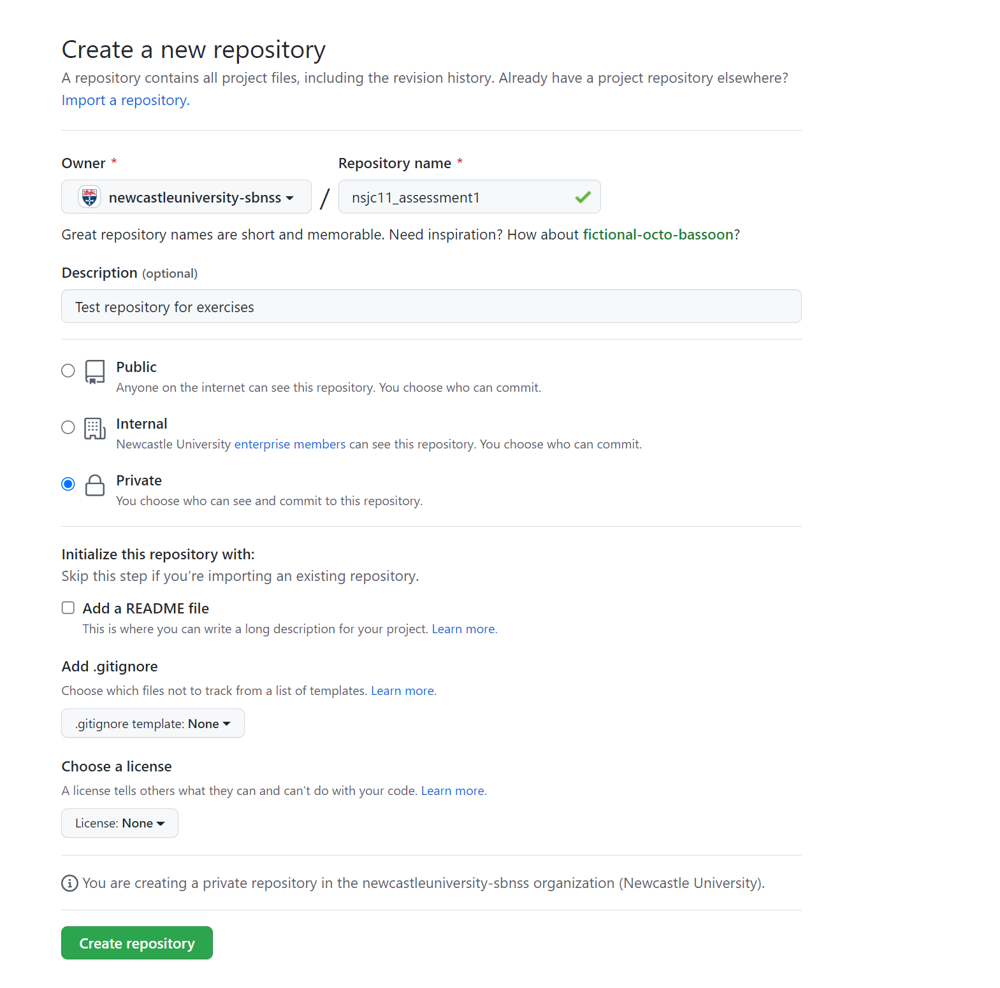
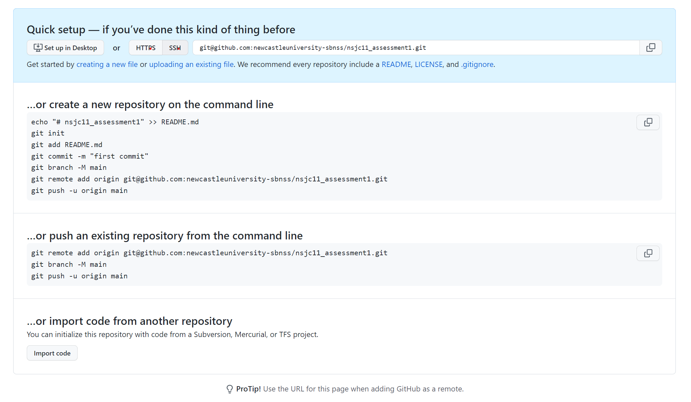

# MMB8052 Practical 03 - Project Management and Version Control

# Introduction

The life of a laboratory scientist is improved by a well organised lab, and lab book. Similarly, the computational scientist's lot is made better by well-organised and well-documented electronic files. It doesn't really matter how big or small the bioinformatics project you're working on is, you will make things easier on yourself by having a project directory laid out in a consistent and easy to understand fashion.

Processing hundreds of sequence files becomes trivial with scripting if these files are consistently named and are organised in a logical directory structure. If the structure and naming conventions are shared between projects, then the scripts written for one project become reusable for the next.

In this practical, we will look at some of the best practices surrounding the organisation and documentation of bioinformatics projects. In addition we will take a look at a modern _version control_ system (VCS), called `git`. Version control is important for managing the process of writing computer code (or other 'plain text' file types) - a VCS is a piece of software which records the changes made to a file or set of files over time, and allows the user to share those changes with others, to work on parallel versions of the same code base, and to rollback changes made to the project at any time.

A good document management process, coupled with robust version control are critical in enabling reproducible computational science. This benefits both the researcher who uses this process, and the wider community who want to re-use the products of their research. This includes (and indeed is primarily aimed at) members of their own lab.

In the exercises below, we will look at one example of project organisation and documentation. I have found that this system works well for me, but you may wish to adapt it for your own way of working. There is no real _correct_ way to organise your files, but I would advocate that _any_ system is better than _no_ system.

# Directory Organisation

Each project should be organised into its own directory, under which should be a common set of sub-directories. All directory names should be meaningful - both to you and to any potential third party. In most projects, you will have at least 3 sub-directories:

 1. `data/` - for storing the raw data associated with the project
 1. `results/` - for storing the output of computational experiments
 1. `scripts/` - for storing the process which takes (1) as input and produces (2) as output.

Additional directories which can be added include things like `extdata/` for storing data external to the project, but required for data processing (such as a reference genome file, for example) and `software/` for saving versions of external software used during the project (though this is often now replaced with a config file for a package management system like [Conda](https://docs.conda.io/en/latest/)).

## Shell Expansion

The `bash` shell you are using at the command line provides you with a number of tricks you can exploit to improve the efficiency of your work. Some of these which you may have already encountered include **tab-completion** (the pressing of the _tab_ key - usually above Caps Lock - leads to `bash` "guessing" the command or file path you want to type), and the **command history** (press the _up_ arrow to cycle back through your recent commands, press Ctrl+R to search your previous commands). Another such trick is shell expansion.

The simplest example of shell expansion is the tilde (`~`) shortcut for your home directory. When you type this character at the command prompt, `bash` expands it to the full path to your home directory. Another commonly seen example of shell expansion are wildcards, where (for example) the asterisk (`*`) is expanded to all matching files:

```bash
# list all files in the home directory which end ".txt"
$ ls ~/*.txt
```

A useful expansion, called _brace expansion_ can be handy when setting up nested directory structures. Brace expansion creates strings by expanding the comma-separated values inside a pair of _curly braces_ (`{}`). See this trivial example:

```bash
$ echo self-{aware,esteem,confident}
self-aware self-esteem self-confident
```

### Exercise 3.1 {: .exercise}

Estimated time: 2 mins

 - Work out a single command which uses brace expansion to create the project directory structure for Assessment 1, bear in mind the following factors:

 1. Directory and file names should not contain spaces (it is good practice to replace spaces with underscores - `_`)
 1. Your project directory should contain the sub-directories described above (`data/`, `results/` and `scripts/`)
 1. Your project directory should be a direct sub-directory of your home directory
 1. `mkdir` has an option which allows it to create nested directories in a single command - we encountered this option int practical 1, use `man mkdir` if you need a refresher

# Documentation

Organising your files well is just one part of effective management of your computational research. Our bioinformatics projects also require good _documentation_. Much like a well-kept lab notebook, the major beneficiary of a well-documented project is future you. Poor documentation can lead to irreproducibility and be a source of potential error.

Lots of complexity can hide in bioinformatics work - large numbers of similar files, vast numbers of program parameters, rapidly changing software and other factors besides. Our best defence against this complexity causing us problems down the line is to keep good documentation - what software version did we use? Paired with which parameters? Why did we make this decision?

## The README file

The most basic level of documentation is the so-called README file. Every project should contain a README in its base directory, which records a standard set of information (or _metadata_) about the experiments carried out in that project. This file is not intended as a complete record of our process (this is what the lab book is for - and even if all your experiments are _dry_, you should still keep a lab book).

| README Section | Description |
|----------------|-------------|
| Author         | Basic information about you and the project (affiliation, date etc). Useful for if the project is redistributed, and a good habit to get into. |
| Process        | Which scripts to run, and in which order. An outline of what each script does, and what it requires to run. |
| Data           | What's the source of the data? When did you download it? Where is it backed-up? What database version does it come from? |
| Software       | What software is required for the project? Which versions did you use? |

## Markdown

Markdown is a simple to write _markup language_ which is easy to convert into different document formats (particularly, but not exclusively, HTML). Since Markdown is a plain text format, it is easy to author using a command line text editor such as `nano` (which we have met in earlier practicals). There are a number of simple guides to the basic syntax of Markdown, [this is a representative example](https://www.markdownguide.org/basic-syntax/).

The simplicity of Markdown makes it an excellent choice for documentation. By way of example, all of the practical guides you have been following during this course have been authored in Markdown and then converted into the webpages you find embedded in Canvas. The raw Markdown for _this_ document can be found here: <https://raw.githubusercontent.com/sjcockell/mmb8852/main/practicals/practical_03.md>.

### Exercise 3.2 {: .exercise}

Estimated time: 5 minutes

 - Using `nano`, write a README file in the base directory of the project structure you created in exercise 3.1.
 - Add a level 1 heading with a document title
 - Add level 2 headings for the README sections detailed above
 - Add information in the Author section, using other Markdown elements as required.

# Software Management

Towards the end of Practical 2, we looked at software installation, particularly using the Linux package manager, APT. This is a robust way of managing software installation on a Linux computer, but suffers from a number of limitations:

- Software must be pre-packaged for APT, and accepted into centrally managed repositories for ease of distribution
- User must have administrator rights to install new software
- APT manages software system-wide, so only one version can be installed

In research computing, there are reasons why we are not able to assume all (or even any) of these things.

- Many scientific software projects do not have the resources to package software in multiple ways
- It is not a given that we will have admin rights on the machine where we want to carry out most of our compute - this is highly unlikely on a shared high-performance computing environment for example
- We often want to manage a number of parallel versions of the same software (for example, one project may be under review, and so need to be maintained on an older software release to ensure consistency, while newer projects make use of the latest version to ensure they are at the cutting edge)

There are a number of modern software management solutions which provide answers to these problems. Probably the best known and most widely used is [Conda](https://docs.conda.io/en/latest/).

## Conda

Anaconda, or Conda is an open source, cross-platform package and environment management system. Initially developed for the Python programming language (hence the "snakey" name), it has since been expanded to manage a wide range of software. Conda is able to help you find and install software packages, and can create, save and load _environments_, allowing us to maintain parallel installations of different software versions and their dependencies (more on this below). Conda is lightweight and doesn't require admin privileges to install or run, and software is relatively simple to package for distribution by a Conda repository (many of which are community-maintained, rather than having a centralised gatekeeper).

In addition to these helpful features which overcome the above limitations of APT, Conda has been widely adopted within the bioinformatics research community, meaning that many software packages produced for bioinformatics are available to install using Conda (a great many more than are available via APT). See the [Bioconda Project](https://bioconda.github.io/) for more information.

## Installing Conda

Conda is installed via a downloadable `bash` script. It is important to download the right script for our system, and to test that the code we've downloaded is what we expect it to be (running arbitrary code downloaded from the internet is a _bad idea_ <sup>TM</sup>). We're installing so-called "Miniconda", which is a minimal installation to save on disk space. The following commands have been tested on Ubuntu 20.04.

```bash
# Download the installer
$ wget https://repo.anaconda.com/miniconda/Miniconda3-latest-Linux-x86_64.sh
# Check it is what it says it is
$ sha256sum Miniconda3-latest-Linux-x86_64.sh
# Output should read:
78f39f9bae971ec1ae7969f0516017f2413f17796670f7040725dd83fcff5689  Miniconda3-latest-Linux-x86_64.sh
# Run the installer
# if the above "hash" does not match exactly
# DO NOT take this next step
# ask a demonstrator if you're not sure
$ bash Miniconda3-py38_4.12.0-Linux-x86_64.sh
```

The `conda` installer will prompt you for some information. Firstly accept the license agreement (use the space bar to page through the agreement, and then type 'yes' when prompted). Accept the default installation location. Type 'yes' when asked if you want the installer to initialize Miniconda3.

In order to be able to use Conda, you will have to log out of your Linux machine and log back in again. You will know it has worked because `(base)` will appear at the beginning of your command prompt - this is the name of your current environment.

The `conda` program is actually a single interface to a number of programs, each of which is accessed by providing a _verb_ as the first argument to `conda`. Examples of these verbs include `conda config`, `conda search` and `conda install`.

### Exercise 3.3 {: .exercise}

Estimated time: 10 minutes

- Install Conda as per the above instructions.

## Channels

A channel is a location where Conda packages are stored and made available for installation. Discovering reliable channels can be a challenge, so we will stick to three publicly available, widely used channels: bioconda, conda-forge and defaults.

Different channels can have the same package, so Conda must handle these channel collisions - it does this by maintaining a list of channel _priorities_. We will set Conda up to always use the three above channels (defaults is used by, well, _default_), and to always use them in the same order, to avoid any conflicts:

```bash
$ conda config --prepend channels conda-forge
$ conda config --prepend channels bioconda
$ conda config --set channel_priority strict
```

## Environments

A Conda environment is essentially a directory which contains a specific collection of Conda packages and all of their dependencies. This allows different environments to be maintained and run separately without interference from one another. The most important consequences of this, with respect to our management of software are the following:

- We can maintain separate installations of _different_ versions of the _same_ software
- By maintaining a list of the software in an environment, we can reinstall that environment using Conda on any computer, thus enabling process reproducibility.

It is good practise to set up and maintain a separate Conda environment for each project you work on, and to ensure you use Conda to manage all of the software in that project. It is then possible to create and maintain a _requirements_ file within that project, which can be used to re-install the environment if necessary.

### Exercise 3.4 {: .exercise}

Estimated time: 10 minutes

We're going to create an environment for the first module assessment, which will contain the software we need to complete the assessment, follow these steps:

- Add the conda-forge and bioconda channels to your Conda config by following the steps in the _Channels_ section, above
- Create a new, empty Conda environment called "assessment1":

```bash
$ conda create --name assessment1
```

- Activate your new environment:

```bash
$ conda activate assessment1
```

- Install the required software:

```bash
$ conda install muscle emboss
```

Finally, save the list of installed software so that we can reinstall the environment later if required:

```bash
$ conda list -e > requirements.txt
```

Move this file (`requirements.txt`) into the base directory of the project directories you created in Exercise 3.1.

# Version Control

Version control is the practice of tracking and managing changes to a set of files over time. It is most commonly used for keeping track of changes made to software code, but can be used for any set of files in which changes can easily be enumerated. Good version control, like the practices of documentation and software management detailed above, is essential in enabling reproducible computational research. Furthermore, good version control is helpful in maintaining a working backup of our important files.

## Git

[Git](https://git-scm.com/) is one of many _version control systems_ (VCS) - software which enables version control. There are many other VCS available, such as [Mercurial](https://www.mercurial-scm.org/) and [Subversion](https://subversion.apache.org/), but Git is probably the most widely used. Git is a _distributed_ VCS, which means it does not require a centralised server to store a master code _repository_ (a feature of older VCS like Subversion).

Version control, and Git, can get very complicated. We are going to introduce the basics of a very linear version management process to try and avoid getting lost in the weeds, but do be aware that we are only scratching the surface.

Like `conda`, `git` functions via the provision of _verbs_ which inform the program of the action to take. We are going to look at a few of these verbs to get an idea of how `git` works.

### Config

The function of most of the basic verbs can be guessed from their name - `config` controls the configuration of Git. There are many config options that can be set, but most important is the `user.email`, which identifies you as the owner of your repositories. To set up this identification:

```bash
$ git config --global user.name "Donald Duck"
$ git config --global user.email "donald@disney.com"
```

### Init

The `git init` command creates a new Git repository. It can be used to convert an existing set of files into a Git repository, or to initialize a new, empty repository. Most other `git` commands do not work without an initialized repository.

```bash
# Turn the current directory into a Git repo
$ git init
# Create a new named repository
$ git init directory_name
Initialized empty Git repository in /home/student/directory_name/.git/
```

### Add

The above `init` command creates a new Git repository, but we have to tell Git explicitly which files to track. The `add` verb is used to "stage" files for version control. By default `add` works recursively, so `git add .` will add all of the files and directories in the current working directory.

```bash
$ cd directory_name
$ touch README
$ git add .
```

### Commit

This is the command which stores a "version" of our project - a Git `commit` is a labelled snapshot of a directory at a particular point in time. We can rollback to these snapshots in the future, should we need to.

```bash
$ git commit -m "My first commit"
[master (root-commit) 7f9046a] My first commit
 1 file changed, 0 insertions(+), 0 deletions(-)
 create mode 100644 README
```

The `-m` option for `commit` allows you to provide a message along with your snapshot. This message is mandatory (if you don't provide one in the command, you'll be made to write one before the commit is completed), and it can be useful to make them informative (so you have some idea of the content of the commit in future). A good commit message is <50 characters.

The `-a` option for `commit` will `add` everything in the repo which is currently unstaged, so the addition of `-a` to your commit will let you skip the `add` step in most cases.

```bash
$ echo "# Document Title" > README
$ git commit -a -m "Edited README"
[master 9968c0c] Edited README
 1 file changed, 1 insertion(+)
```

### Reset

There wouldn't be much "control" in the concept of version control if we couldn't rollback changes we've made to a previous version - `reset` is the Git command which allows this. For example, if we make an accidental destructive change to our code, which subsequently gets committed:

```bash
$ cat README
\# Document Title
$ echo "A destructive change" > README
$ git commit -a -m "Oops"
[master 23caffb] Oops
 1 file changed, 1 insertion(+), 1 deletion(-)
```

This code overwrites the content of the README file (we only used one `>`, instead of two). We've committed the change, but we can rollback to a version before we made this change. First of all, we have to find an identifier for the version:

```bash
$ git log
commit 23caffb449f1bdb64f8e7c9045a0337ea27ce842 (HEAD -> master)
Author: Donald Duck <donald@disney.com>
Date:   Thu Sep 8 12:49:38 2022 +0100

    Oops

commit 9968c0ca517f2ddcf9c18e5216edea8784101b28
Author: Donald Duck <donald@disney.com>
Date:   Thu Sep 8 12:37:05 2022 +0100

    Edited README

commit 7f9046a171e76d08b7c54e72d25ce44a109d131b
Author: Donald Duck <donald@disney.com>
Date:   Thu Sep 8 12:33:55 2022 +0100

    My first commit
```

The `log` verb shows you the history of your repository, in reverse chronological order. The identifier for each commit is the long string which comes after `commit`, so the identifier of our first commit here is `7f9046a171e76d08b7c54e72d25ce44a109d131b`. For the purposes of `reset`, the first 7 characters of this strong is sufficient as an identifier: `7f9046a`. In order to step back one commit in time, we want to tell `reset` to go back to the second commit, in this case identified by `9968c0c`:

```bash
$ cat README
A destructive change
$ git reset --hard 9968c0c
HEAD is now at 9968c0c Edited README
$ cat README
# Document Title
```

If we re-run `git log` we will also find the 3rd commit has disappeared from the history of the repository.

### Exercise 3.5 {: .exercise}

Estimated time: 15 minutes

- Use the `git init` as above to turn the Assessment 1 directories you created in earlier exercises into a Git repository
- Make sure you `add` the files and directories that you've already made
- Commit your files so far, with a meaningful commit message

## Github

So far, all of our operations with Git have been with a local repository. Git also allows us to work with _remote repositories_ which enables useful features like offsite backup and collaboration.

[Github](https://github.com/) is a service, owned by Microsoft, which we can use as a centralised server for a remote Git repository. It is commonly used by software developers to host open source projects, including significant projects such as the [Linux kernel](https://github.com/torvalds/linux), [Python](https://github.com/python/cpython) and [Conda](https://github.com/conda/conda).

Github operates a _freemium_ service - it is possible to sign up for an account for free and work extensively with Github - including being able to create an unlimited number of public and private repositories. Newcastle University has an Enterprise account with Github, which allows users at the University to benefit from a range of additional features. In order to join the University Github _organisation_ you must first have a personal account.

### Exercise 3.6 {: .exercise}

Estimated time: 5 minutes

- Go to <https://github.com> and make an account
- You should have received an email invitation to the newcastleuniversity-snbss organisation - follow the instructions to join the organsiation

### Uploading a repository to Github

Turning a local repository into one hosted on Github can be quite fiddley, because a number of factors have to be accounted for in the correct way for it to work. The general procedure goes as follows:

1. Make a new repository on Github - click the "+" in the top right of the page, then "New repository" from the resulting dropdown.
1. Fill in the form that appears:
    - Click on the 'Single Sign on' link if it is there to enable the creation of a private repository within the newcastleuniveristy-snbss organisation
    - Choose "newcastleuniversity-sbnss" as the "Owner", and name your repository `username_assessment1` where `username` = your University login
    - Make the repository Private
    - Don't add a README, .gitignore or a license at this stage
  
    |  |
    |:--:|
    | <b>Figure 1: Create Repository Form</b>|

2. Click "Create repository"
3. Now we've created an empty repository, to populate it with a pre-existing local repository, follow the instructions on the screen that appears next:
    |  |
    |:--:|
    | <b>Figure 2: Populate Repository Instructions</b>|
4. Make sure "SSH" is selected at the top of the page
5. Follow the "push an existing repository" instructions
    - In the root directory of the local repo, run the `git remote add` line from the instructions you have (which will have the correct address for your personal repo)
    - Run `git branch -M main` to rename the current branch to "main"
    - Run `git push -u origin main` to send your currently committed repository to Github
6. The push step won't work until we sort out how to authenticate with Github from the command line. We do this by _public key authentication_, take the following steps:
    - Create a new public/private key pair on the VM: `ssh-keygen -t ed25519 -C "email@example.com"` - be sure to change the email address so it matches the address you used to register on Github
    - When creating the key, write it to the default location, and leave the passphrase blank
    - Copy the public key to your clipboard (`cat ~/.ssh/id_ed25519.pub`, then copy the output)
    - Add a new SSH key in your Github account (follow the instructions here: <https://docs.github.com/en/authentication/connecting-to-github-with-ssh/adding-a-new-ssh-key-to-your-github-account#adding-a-new-ssh-key-to-your-account>)
    - Use single sign on to _authenticate_ your key (the instructions for this step are here: <https://docs.github.com/en/enterprise-cloud@latest/authentication/authenticating-with-saml-single-sign-on/authorizing-an-ssh-key-for-use-with-saml-single-sign-on>)
7. Now retry the push step from step 6 (`git push -u origin main`)

If we now visit our Github repository in a web browser, we can see the contents of our _local_ repository have been added to this _remote_ version. To keep the remote repository up-to-date, we have to ensure we `git push` after every `git commit`.

### Exercise 3.7 {: .exercise}

Estimated time: 10 minutes

- Push the repository you made in exercise 3.5 to a Github repository, as per the instructions above.
- Make a change to the contents of your repository (edit the README file, or add a new file somewhere for example)
- `commit` the change locally, and `push` it to Github
- Check your repository on Github to ensure your local change has been mirrored remotely

**HINT** - After the first time you `push` to a remote repository, `git` will assume that every subsequent `push` is to the same remote location as last time, so `git push -u origin main` can be replaced with the simpler `git push`.

# Summary

This practical may seem a little out of place, with respect to the practical skills being demonstrated in the other sessions, but the tools and techniques shown here are valuable professional skills which are extremely valuable when it comes to managing your computational research. Many bioinformatics projects manage their code using Git and Github, and being able to understand and work with these systems is often vital to working with such systems.

In a research environment, you are expected to document your experiments and your progress - keeping a good quality lab notebook is a valuable skill. The same is true, though often under-appreciated, for computational research. Being organised, and documenting your work effectively will be beneficial in many ways.
