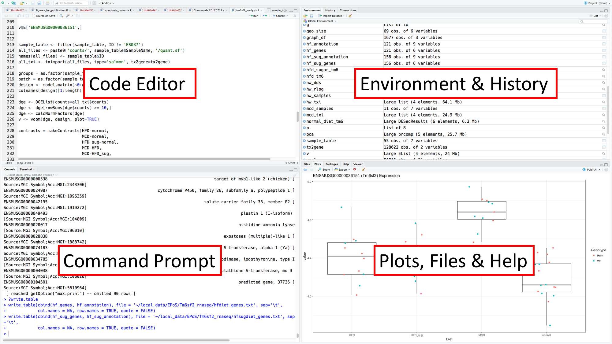

# MMB8052 Practical 02 - Introduction to R Programming

# Introduction

[R](https://www.r-project.org/) is an open-source, free programming language created by statisticians Ross Ihaka and Robert Gentleman in the 1990s. R was intended as a language for statistical analysis and data visualisation. It is used extensively in bioinformatics because it enables the manipulation and analysis of very large data sets.

R is an extensible environment and new functionality can be added to the core language via the installation of _packages_. There are large existing repositories of these packages for R, including the [Comprehensive R Archive Network](https://cran.r-project.org/) (CRAN) which includes thousands of packages covering many use-cases, and [Bioconductor](https://bioconductor.org/) which caters specifically for the analysis of biological data. Many packages published in these repositories are peer-reviewed products of statistical and bioinformatics research.

These key features of R (open source, extensible, designed for statistics) mean that it has found a niche as one of the principle programming languages for _data science_, along with [Python](https://www.python.org/). We are focussing on R largely because of the Bioconductor repository of bioinformatics packages, which is an invaluable resource for biological data analysis.

## RStudio

In these practicals we will be using [RStudio](https://www.rstudio.com/) as an interface to R. RStudio is an _Integrated Development Environment_ (IDE) designed specifically for working with R. It is a relatively user friendly interface to R, and has many advantages over using the stand-alone R command prompt. R and RStudio are installed on the computers in the clusters we are using for these practicals - look for RStudio in the Start menu.

|  |
|:--:|
| <b>Figure 1: The typical 4 pane layout of RStudio</b>|

RStudio splits the application window into up to 4 panes, by default these panes contain a code editor (top left, closed when you first run RStudio), the R command prompt (also known as the _console_, bottom left), the current R _environment_ and a command history (top right) and plots, a file explorer, and help information (bottom right). These panes are all inter-related, for example, code written in the code editor can be sent to the console by pressing Ctrl+Enter. The results of executing this code can also effect the other panes - new variables created will appear in the Environment, graphical output will appear in Plots, and so on.

### Installing R and RStudio

If you want to work on your own computer, you will need to install R and RStudio:

- Download & install the correct version of R (<https://www.stats.bris.ac.uk/R/) for your operating system
- Download & install the correct version of RStudio (<https://www.rstudio.com/products/rstudio/download/#download>) for your operating system

### Exercise 4.1 {: .exercise}

Estimated time: 5 minutes

- Open RStudio, and type the following mathematical commands in the Console
      - Each command starts with a `>` - this is to show where the command begins (c.f. the `$` we used for bash commands) - you don't need to type this

```r
> 4 + 9
> 2 + 5 * 7
> 10.2 / 3 - 2
> 2 ^ 4
> 7 / 3
> 7 %/% 3
> 7 %% 3
```

- From the results of this operations, can you figure out:
    - How R handles the order of mathematical operations
    - What the `^` symbol does
    - What the 3 different division related (`/`, `%/%` and `%%`) operators are doing

## Data Types (single values)

Every value in R has a _data type_. There are 5 basic data types (although we only need to worry about 3 of them here):

- character (e.g. `"a"`, `"bioinformatics"`)
- numeric (decimal numbers, e.g. `2`, `2.1`, `pi`)
- integer (whole numbers, e.g. `2L`)
- logical (`TRUE`, `FALSE`)
- complex (e.g. 3 + 2i)

We are only going to encounter characters, numerics and logicals during this course.

## Operators

Operators are symbolic representations of mathematical, relational and logical manipulations. R has a range of operators to represent a number of these concepts. In exercise 4.1 we used a range of mathematical operators:

| Operator | Description |
|----------|-------------|
| + | Addition |
| - | Subtraction |
| * | Multiplication |
| / | Division |
| ^ | Exponent |
| %/% | Integer division |
| %% | Modulus (remainder from integer division) |

### What about the equals sign (=)?

The one major mathematical symbol notable by its absence here is the equals sign. In R (as in many other programming languages) `=` is used for the _assignment_ of a value to a variable. We've already encountered variable assignment in `bash`, and R works in a similar way (but with a simpler syntax). The result of the operation on the right of `=` is assigned to the variable name on the left:

```r
> x = 2 + 2
> x
[1] 4
```

We'll come back to what the `[1]` means later, the result here is showing you that `x` has the value `4` (i.e. the result of `2 + 2`).

### Relational operators

This class of operator is used to compare between values. The way this works is most obvious with numerical values, but all data types in R have a natural order. The output from the use of a relational operator is a logical (`TRUE` or `FALSE`).

| Operator | Description |
|----------|-------------|
| < | Less than |
| > | Greater than |
| <= | Less than or equal to |
| >= | Greater than or equal to |
| == | Equal to |
| != | Not equal to |


```r
> 1 > 2
[1] FALSE
> 1 < 2
[1] TRUE
> 6 + 2 == 4 + 4
[1] TRUE
> "a" < "b"
[1] TRUE
> TRUE > FALSE
[1] FALSE
```

## Functions

R includes many functions, which can be considered as sub-programs which take inputs (arguments), carry out calculations and return outputs. In the following example, the logarithm function `log` is being called. This returns the natural logarithm of the argument (in this case 10):

```r
> log(10)
[1] 2.302585
```

The behaviour of this function can be further modified by providing optional _arguments_. In this case, we can specify the base to calculate the logarithm in by providing the `base` argument. Arguments to functions are separated by commas:

```r
> log(10, base=10)
[1] 1
```

R functions have documentation (like `man` pages in Linux). The way to access the help for a function is to precede the function name with `?`. So to view the help page for `log()`, type `?log` in the console.
