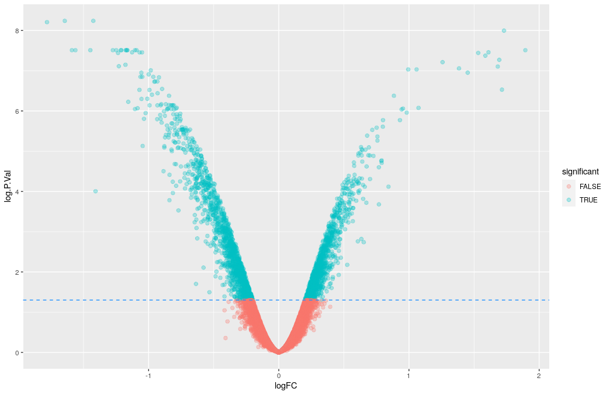

# MMB8052 Practical 05 - Continuing R Programming, Tidy Data and Visualisation

# Introduction

Practical 4 introduced us to the R programming language and working in RStudio. We discovered the basic data types and operators in R, and how to apply functions. In this second practical on the fundamentals of R we will be investigating the extensibility of R and how to install packages, what is meant by "tidy" data and how we can apply these principles to our own analysis and we'll also be looking at using R to visualise data in a number of ways.

# Packages

So far we have only explored what is known as the _base_ functionality of R - that is the core features of the language which are available in the main R download. Base R is a complete programming language, capable of accomplishing any computational task we can conceive of (R is what is known as a _Turing complete_ programming language). This ability does not necessarily mean it is _convenient_ to use base R for everything however. The nature of R, as described in the last practical, is that it is an _extensible_ language. It is possible to compose extensions to the base language known as _packages_.

An R package is a set of files that we can reference from our code which gives us access to new functions and data structures. Packages have been written to offer all kinds of functionality in R including, but not limited to, advanced statistics, machine learning and data visualisation. As of June 2022, there were over 18,000 packages available on the Comprehensive R Archive Network (CRAN) the most popular public repository for R packages. Bioconductor release 3.15 (April 2022) contains 2,140 packages for bioinformatics analysis.

## Package Installation

In order to make use of a package within R, we first need to install it. Base R comes with a function for the installation of new packages, usefully called `install.packages()`. You can also find out which packages are already installed on your system using `installed.packages()` (even base R comes with some packages already installed).

For example, base R contains functions for basic statistics calculated with vectors, but only rudimentary functions for working with matrices (base functions include `rowSums` and `rowMeans`, and the equivalent functions for columns). The installable package `matrixStats`, however, adds a range of other functions which can be applied to a matrix to further understand the data therein:

```r
> install.packages("matrixStats")
> x = matrix(rnorm(200), nrow=20)
> rowSums(x)
> rowMeans(x)
> rowSds(x)
Error in rowSds(x) : could not find function "rowSds"
> library(matrixStats)
> rowSds(x)
```

In this code block, we first make a matrix of some normally distributed data. Although we've installed the `matrixStats` package in the first line, the function `rowSds`, which calculates the row-wise standard deviations, is not available to us until we _attach_ it to our R session, which we accomplish with the `library()` function. After this line, we can use `rowSds()` to calculate the standard deviation of the rows of our matrix.

### Exercise 5.1  {: .exercise}

Estimated time: 5 minutes

- Install the `matrixStats` package, as above.
- Browse the package documentation - `help(package="matrixStats")`.
- Test out some of the functions on a matrix of random data, like the one created above.

Specifically, can you find out the difference between the base function `rowSums()` and the `matrixStats` function `rowSums2()`?

Mathematically, what's the difference between `rowSds()`, `rowVars()` and `rowMads()`?

# Tidyverse

The [_Tidyverse_](https://www.tidyverse.org/) is set of packages available through CRAN. It describes itself as “an opinionated collection of R packages designed for data science”. Components of the Tidyverse provide convenient methods for reading, writing, visualising and organising data. The core Tidyverse consists of eight packages: `ggplot2`, `tibble`, `tidyr`, `readr`, `purrr`, `stringr`, `forcats` and `dplyr`. These packages can be installed via a conventient _metapackage_ called `tidyverse`:

```r
> install.packages("tidyverse")
```

## Tidy Data

While we're not going to spend a lot of time on the satellite packages of the Tidyverse, we are going to take a detailed look at visualising data with `ggplot2`, so it can be helpful to understand what the authors of the Tidyverse mean when they talk about _tidy data_. For a simple dataset to be considered tidy, it needs to be arranged in a particular way, so that every row in the dataset contains a single observation, with any additional data required to qualify or understand that observation recorded alongside it in the same row. This is often described as _long format_ data. We are often more used to _wide format_ data, the difference is shown in the tables below.

First, the more familiar wide format:

|            | Sample 1 | Sample 2 | Sample 3 | Sample 4 | Sample 5 | Sample 6
|------------|----------|----------|----------|----------|----------|---------
| **Gene A** | 0.718    | 1.221    | 0.086    | 0.079    | 1.136    | 0.914
| **Gene B** | 0.483    | 0.524    | 0.523    | 0.083    | -0.527   | -1.208
| **Gene C** | -0.444   | 0.641    | -1.432   | -0.266   | -0.049   | 1.372
| **Gene D** | 1.058    | -1.087   | 0.091    | 1.731    | -0.699   | -0.756
| **Gene E** | -0.103   | -1.309   | 2.212    | -0.731   | 0.719    | -0.289
| **Gene F** | -0.074   | -1.511   | -0.319   | 0.373    | -0.760   | -0.984

Here, each observation occupies a cell in the table, and any _metadata_ is restricted to the row and column names.

The same data, encoded in long format:

| Sample | Gene | Value |
|--------|------|-------|
| 1 | A | 0.718   |
| 1 | B | 0.483   |
| 1 | C | -0.444  |
| 1 | D | 1.058   |
| 1 | E | -0.103  |
| 1 | F | -0.074  |
| 2 | A | 1.221   |
| 2 | B | 0.524   |
| 2 | C | 0.641   |
| 2 | D | -1.087  |
| 2 | E | -1.309  |
| 2 | F | -1.511  |
| 3 | A | 0.086   |
| 3 | B | 0.523   |
| 3 | C | -1.432  |
| 3 | D | 0.091   |
| 3 | E | 2.212   |
| 3 | F | -0.319  |
| 4 | A | 0.079   |
| 4 | B | 0.083   |
| 4 | C | -0.266  |
| 4 | D | 1.731   |
| 4 | E | -0.731  |
| 4 | F | 0.373   |
| 5 | A | 1.136   |
| 5 | B | -0.527  |
| 5 | C | -0.049  |
| 5 | D | -0.699  |
| 5 | E | 0.719   |
| 5 | F | -0.760  |
| 6 | A | 0.914   |
| 6 | B | -1.208  |
| 6 | C | 1.372   |
| 6 | D | -0.756  |
| 6 | E | -0.289  |
| 6 | F | -0.984  |

The advantage of having the data arranged in this way is that we can trivially add extra information to each observation and maintain the same format. For example, if samples 1-3 were "wild-type" and samples 4-6 were "mutant" we could add an additional _genotype_ column to the long data to store this information. In the case of wide data, you would typically have to create a second data frame which contained this information about the columns (and likewise for the rows).

It is possible to turn a wide matrix into a long data frame using the `tidyr` package, which contains a function called `pivot_longer()` (as well as `pivot_wider()` for the reverse operation). Note that for this to work properly, the rownames of our matrix must be a column in their own right, meaning that the conversion becomes a bit of a shuffle.

```r
> library(tidyverse)
# make some data first:
> dat = matrix(rnorm(36), nrow=6)
# now name the rows and columns:
> colnames(dat) = paste0('sample_', 1:6)
> rownames(dat) = paste0('gene_', LETTERS[1:6])
# turn it into a data.frame:
> dat = as.data.frame(dat)
# add the row.names as a column:
> dat = rownames_to_column(dat, var="Gene")
# now pivot_longer:
> dat_long = pivot_longer(dat, cols=starts_with("sample"))
```

This is a realistic set of operations in R, and it is common to have to perform these kind of rearrangements in any real data analysis. Collectively this is known as data _munging_ or _wrangling_.

Another thing to note here: the output of `pivot_longer()` is a `tibble`. This is a special type of `data.frame` introduced in the Tidyverse. Tibbles have some features added for convenience, but can mostly be treated like a data frame. In instances where they can't, you can turn a tibble back into a data frame using the `as.data.frame()` function (which, as demonstrated above, also works with a matrix).

## readr

The `readr` package provides functions for turning flat text files into tibbles. `read_csv()` is for comma separated value files, `read_tsv()` is for tab-delimited files and the generic `read_delim()` allows you to define any delimiter. These types of delimited files are commonplace in bioinformatics.

As well as reading files on our hard-drive, we can also point the `readr` functions at a file in a network location, allowing us to read data directly from the web into R.

For example, we can load the file we used in practical 2 to demonstrate `sort` at the command line:

```r
> de_data = read_tsv("https://github.com/sjcockell/mmb8052/raw/main/practicals/data/example.txt")
```

It is also worth noting the `readxl` package, which is a subsidiary Tidyverse package that makes it straightforward to get data out of Excel and into R.

### Exercise 5.2  {: .exercise}

Estimated time: 8 minutes

- Use `readr` to load the tab-separated value file found at <https://github.com/sjcockell/mmb8052/raw/main/practicals/data/example_data.tsv>
- Take a look at the data you've loaded (**HINT** - the RStudio built-in `View()` function is good for this)
- Use `pivot_longer()` to make a _long_ version of the data
- Turn it into a matrix, preserving the `gene_id` column as `rownames`

Consider these questions:

- Is it best to overwrite the variable containing the data every time, or make copies? (i.e. `data = mutate(data)` vs `data2 = mutate(data1)`)
- How easy is it to _undo_ `pivot_longer()`?

## dplyr

As mentioned above, a certain amount of data wrangling is to be expected with any type of realistic data analysis - not all data tends to be formatted cleanly or exactly as we expect or need it. The `dplyr` package is designed to make this kind of data manipulation tasks easier.

One of the key features of `dplyr` is that we can refer to column names as variables in our function calls. This can make `dplyr` code easier to write, and to read, than the standard base alternatives.

### Examples

Using `filter` to extract specific rows:

```r
> filter(de_data, adj.P.Val < 0.05)
# same result:
> de_data[de_data$adj.P.Val < 0.05,]
```

As seen in the last practical, filtering data according to some property of the data itself can be an extremely useful operation. The base R syntax for this can be clunky and become hard to read, `dplyr`'s `filter()` function is often a cleaner way of achieving the same result.

Using `select` to extract a set of columns:

```r
> select(de_data, geneSymbol, logFC, adj.P.Val)
```

This function will return a tibble with just the columns named in the arguments.

You should be aware that many packages contain functions with the same name. For example, there are functions called `select()` in several other R packages. If you have loaded libraries containing functions with matching names, the function in the last package loaded will be used (functions with the same name in packages loaded earlier are _masked_). To specify a function from a particular package, use the package name followed by the double colon operator `::` and the function name. For example, to specify the `select` function from the `dplyr` package in the last example:

```r
> dplyr::select(de_data, geneSymbol, logFC, adj.P.Val)
```

`select()` allows you to exclude columns as well:

```r
> select(de_data, -geneName)
```

In addition to this, `select()` has helper functions for conveniently selecting groups of columns:

```r
> select(de_data, starts_with("gene"))
> select(de_data, ends_with("e"))
> select(de_data, contains("Val"))
```

Using `arrange` to re-order rows based on the values in columns:

```r
> arrange(de_data, logFC)
```

By default the rows are re-ordered in ascending order, the `desc()` function lets us reverse this:

```r
> arrange(de_data, desc(logFC))
```

Using `mutate` to define new columns that are functions of existing columns:

```r
> mutate(de_data, absFC=abs(logFC))
```

### Exercise 5.3  {: .exercise}

Estimated time: 8 minutes

- Work through the `dplyr` examples above, paying close attention to the effect of each function on the `de_data` tibble
- How would you save the results of these operations?
- Use `mutate()` to add a fold change ratio column to the tibble, based on the `logFC` column

HINT - the `logFC` column contains base 2 logarithms - the linear scale ratios can be found by calculating the _antilog_ of this value.

$$ y = log_2 (x) $$
$$ x = 2^{y} $$

- Take a look at the relationship between the log fold changes and the ratios you've just calculated. Why do you think we typically express fold changes in logarithmic space?

## ggplot2

R has always provided powerful methods for data visualisation. Base plotting functions can be used in many and varied ways to create versatile visual representations of data. It is often the case, however, that the default plotting methods are difficult to configure in order to produce attractive results. The Tidyverse graphics package `ggplot2` was designed to make default plots which look good and take care of often fiddly details like drawing legends, and to provide configurability which makes creating novel graphics tailored to our specific problem straightforward - once we understand how the [_grammar of graphics_](https://libsearch.ncl.ac.uk/permalink/f/1kstl9b/NCL_ALMA2160787020002411) works.

`ggplot2` works in _layers_ - starting with a raw data layer, and then adding annotations and statistical summaries on top of this. This way of working allows us to build our visualisation _iteratively_, gradually adding information and improving things until we arrive at the end result.

**NOTE** - `ggplot2` expects tidy data as an input - as described above that's data formatted so that each observation is in its own row. If we have a matrix of numbers, we would have to `pivot_longer()` to use it as input for `ggplot2`.

### Examples

Let's illustrate how this works with an example, using the `de_data` tibble we've been exploring.

Every plot produced with `ggplot2` begins with two key components - the data we want to visualise and a set of _aesthetic properties_ which describe the relationship between the variables in our data (the columns of our tibble) and visual properties. At the most basic level, we need to tell `ggplot2` which variables comprise the x- and y-axes. Aesthetic mappings are defined using the `aes()` function.

```r
> ggplot(data=de_data, aes(x=logFC, y=adj.P.Val))
```

|  |
|:--:|
| <b>Figure 1: Just the axes</b>|

This first command just produces the axes of our plot, the limits of which are governed by the range of the `x` and `y` aesthetics we've told `ggplot()` to use. To add a visualsation of the data to these axes, we need to provide a description of the geometry of the rendering - this is done with a `geom` function. We add layers to our plot by literally _adding_ them (using the `+` operator):

```r
> ggplot(data=de_data, aes(x=logFC, y=adj.P.Val)) + geom_point()
```

|  |
|:--:|
| <b>Figure 2: Adding some points</b>|

As the name suggests, `geom_point()` is a geometry which adds a point for each pair of `x` and `y` values.

We can use a `scale` to transform the y-axis - p-values are compressed in such a way that the values we are most interested in occupy only 1/20th of the scale (0.05 - 0). A log transformation expands this scale and emphasises the most important values:

```r
> ggplot(de_data, aes(x=logFC, y=adj.P.Val)) + geom_point() + scale_y_continuous(trans="log10")
```

|  |
|:--:|
| <b>Figure 3: Adding a log transformation</b>|

This is an improvement, but the final step in getting these points arranged in the best way for the data is to invert the y-axis (so the points with the smallest p-value are highest up the plot). Unfortunately we can't apply two scalings to the same axis, so we'll have to transform the data instead:

```r
> de_data = mutate(de_data, log.P.Val=-log10(adj.P.Val))
> ggplot(de_data, aes(x=logFC, y=log.P.Val)) + geom_point()
```

|  |
|:--:|
| <b>Figure 4: Inverting the y-axis</b>|

This demonstrates that since each observation is contained within its own row, adding a new variable to the observations is as simple as defining a new column in the tibble.

Next, we will add an additional variable which will help us modify the colour of our points, dependent on whether they pass a significance check (adj.P.Val < 0.05). We can use this variable to colour the points by adding an additional aesthetic mapping. This can be done in the original `ggplot()` function call, or in the specific `geom` where we want the colour applied:

```r
> de_data = mutate(de_data, significant=adj.P.Val<0.05)
# the next two commands produce the same result
> ggplot(de_data, aes(x=logFC, y=log.P.Val, colour=significant)) + geom_point()
> ggplot(de_data, aes(x=logFC, y=log.P.Val)) + geom_point(aes(colour=significant))
```

|  |
|:--:|
| <b>Figure 5: Adding a variable colour</b>|


Finally, we can add additional layers to the plot, either based on the data in the input table, or using constants. For example, we could add a horizontal line showing the value of the p-value threshold (transformed in the same way as the p-values):

```r
> ggplot(de_data, aes(x=logFC, y=log.P.Val)) +
    geom_point(aes(colour=significant)) +
    geom_hline(yintercept=-log10(0.05))
```

|  |
|:--:|
| <b>Figure 6: Adding a new layer, using a constant</b>|

### Global vs local styling

As we've already seen, it's possible to use _aesthetics_ to map a data variable to an element of the plot's style - this can be done with colour, shape, size and a range of other visual components. It is also possible to change the style of all of the elements of a plot. For this, you would include the required adjustment _outside_ of the call to `aes()`. With the previous plot, we could tinker with the colour and style of the line we added, and we can play with the size and transparency (`alpha`) of the points:

```r
> ggplot(de_data, aes(x=logFC, y=log.P.Val)) +
    geom_point(aes(colour=significant), alpha=0.3, size=2) +
    geom_hline(yintercept=-log10(0.05), linetype=2, colour="dodgerblue")
```

|  |
|:--:|
| <b>Figure 7: Changing the style of _all_ the points</b>|

**NOTE** - R has 6 linetypes, and [657 named colours](https://derekogle.com/NCGraphing/img/colorbynames.png). You can get a list of the colour names by running `color()`.

By default, `ggplot2` chooses a colour palette for us - the colours used are defined so that they are optimslly far apart on the colour wheel, and so easy to tell apart. It is possible, though, to define our own colour scheme:

```r
ggplot(de_data, aes(x=logFC, y=log.P.Val)) +
  geom_point(aes(colour=significant), alpha=0.3, size=2) +
  scale_color_manual(values=c('black','red')) +
  geom_hline(yintercept=-log10(0.05), linetype="dashed", colour="dodgerblue")
```

|  |
|:--:|
| <b>Figure 8: Manual colour scheme</b>|

### Themes

There are a number of pre-defined `ggplot2` themes which allow us to quickly restyle our whole plot. These themes control the look and feel of many of the elements of the plot overall. Just as with other layers, it is possible to _add_ a theme to our plot.

```r
ggplot(de_data, aes(x=logFC, y=log.P.Val)) +
  geom_point(aes(colour=significant), alpha=0.3, size=2) +
  scale_color_manual(values=c('black','red')) +
  geom_hline(yintercept=-log10(0.05), linetype="dashed", colour="dodgerblue")+
  theme_bw()
```

|  |
|:--:|
| <b>Figure 9: Plot with a theme (`theme_bw()`) applied</b>|

`theme_bw()` is popular - particularly because it removes the grey background of the default plot which proves fairly divisive. There is a package of additional themes available (`ggthemes`).

### Exercise 5.4  {: .exercise}

Estimated time: 15-20 minutes

Recreate the plot above, and add the following elements:

- Vertical lines denoting a fold-change cutoff of 2x (remember to convert to log-space)
- Alter the point colour to give 3 categories - passed p-value and fold-change thresholds, passed only p-value threshold, failed both thresholds
- Experiment with colours and linetypes to try to improve the look of the plot
