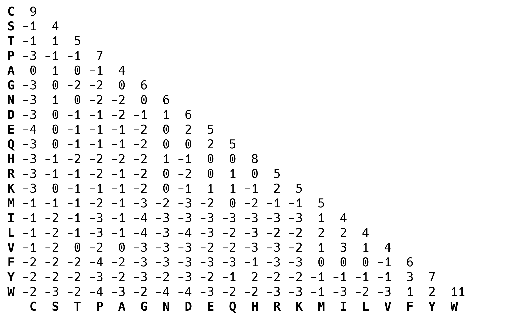

# MMB8052 Practical 06 - Case Study I: Sequence Alignment

# Introduction

The alignment of biological sequences is a core technique in bioinformatics. Without effective algorithms for sequence alignment we wouldn't have methods for predicting protein structure, for working with genome-scale sequencing data or for studying evolution at the molecular level. The foundational algorithms for aligning sequences were developed in the 70s and 80s, and are still used today.

This practical will look at some applications of sequence alignment - including the optimal alignment of two sequences, the use of alignment techniques to search large databases and the simultaneous alignment of multiple sequences. We will use command line tools to explore these applications.

# Principles of Sequence Alignment

Biological sequence alignment relies on an understanding of the molecular mechanisms of evolution, and makes the base assumption that the sequences in an alignment share a common ancestor. The alignment process therefore, is seeking to mirror the point mutations, insertions and deletions which over evolutionary time have given rise to the divergence between the sequences. Of course, this ancestral sequence is unobservable and can only be guessed at - a good quality sequence alignment algorithm will seek to provide an _optimal_ alignment given the available knowledge (i.e. the observable sequences, and the likelihood of certain events occurring).

## Global and Local Alignment

A global alignment algorithm attempts to align every position in every sequence in an alignment. This strategy is most useful when the sequences being aligned are similar and of roughly equivalent size. Local alignments are more useful for dissimilar sequences, or sequences which are expected to contain modules of similarity (_domains_ or _motifs_) within their larger sequence context. A local alignment algorithm does not require a match to be found for every position in the sequences, but can be truncated to preserve only the best matching portion.

The best alignment strategy to choose in any given situation depends on the sequences being analysed, and on the end-goals of the analysis being planned.

## Similarity, Identity and Homology

It has generally been found to be true that a preserved relationship at the sequence level implies a similar conservation of function. We describe the conservation of sequence in terms of sequence identity and (in the case of protein sequences) similarity.

Identity is defined as the percentage of shared positions in a sequence alignment. For example, if in a sequence alignment a pair of sequences have 48 out of 147 positions in common the are said to share 32.65% _identity_.

Similarity is used to describe the relationship between protein sequences in an alignment, and relies on the fact that certain amino acids share similar physiochemical properties and that substitutions between them can be said to be _conservative_. Taking these similarities into account when examining the relationship between sequences means we can calculate a score for the _similarity_.

|  |
|:--:|
| <b>Figure 1: Sequence Identity and Similarity</b>|

Homology is a boolean property shared by sequences of sufficient similarity. Sequences of shared ancestry are said to be _homologous_ - and sequences are either homologous or not, there are no degrees of homology. Homology can exist between species (_orthology_), arising due to a speciation event, or within species (_paralogy_), arising due to a duplication event.

# Pairwise Sequence Alignment

Pairwise sequence alignment methods are used to find the best matching global or local alignments of two query sequences. Methods which use a technique called _dynamic programming_ which are able to find the optimal pairwise alignments were devised in the 70s and 80s. In theory, this renders pairwise alignment a "solved" problem, but the relative efficiency of these methods has meant there has been considerable room for innovation with heuristic methods, which do not guarantee the best alignment but are significantly more efficient than dynamic programming methods.

## Needleman-Wunsch Global Alignment

The Needleman-Wunsch algorithm uses dynamic programming, which breaks down a large problem (finding the optimal sequence alignment) into discrete small steps (scoring the different possibilities at each position of the alignment). In this way, the algorithm is able to efficiently score all possible alignment paths, enabling the choice of the optimal alignment.

This algorithmic approach has to be combined with a robust scoring system. In this way, the effect of allowing a substitution or introducing a gap at each mismatching position in the alignment can be assessed in light of the overall alignment score.

Nucleic acid alignments are normally scored by a simple system where a match carries a positive score and a mismatch carries a negative score. Gaps then usually incur a large penalty to open, but then a smaller penalty to extend, so that a small number of larger gaps is favoured.

Amino acid alignment scoring is more complicated, and usually involves a _substitution matrix_, which encodes different mismatch penalties for different substitutions. This recognises the fact that some amino acid mutations are more likely to occur (due to the nature of the genetic code), and some have a more deleterious effect on protein function than others. Common substitution matrices are based on empirical observation of amino acid changes in closely related biological sequences. For example the popular BLOSUM matrices are generated based on ungapped alignments from the [BLOCKS database](https://academic.oup.com/nar/article/24/1/197/2359962).

|  |
|:--:|
| <b>Figure 2: The BLOSUM62 Substitution Matrix</b>|

### Exercise 6.1 {: .exercise}

Estimated time: 10 minutes

- Download the FASTA sequence for the following UniProt entries: P69905, P01942
- Using Conda, install the software package `emboss`
- Read the help information for the Emboss tool `needle`
- Use `needle` to globally align the two sequences you've downloaded

```bash
$ needle -asequence P69905.fasta -bsequence P01942.fasta -gapopen 10.0 -gapextend 0.5 -outfile exercise6_1.needle
```

Consider the following:

- Can you find out more about Emboss and the tools it contains?
- What does the default output of `needle` look like? 
- What's the identity and similarity of the two sequences you downloaded?

## Smith-Waterman Local Alignment  

The Smith-Waterman algorithm was published in 1981 and is an adaptation of Needleman-Wunsch which allows for truncation of alignments to produce high quality _local_ alignments. Since there's no requirement to align the full length of protein sequences, highly conserved _regions_ of otherwise divergent proteins can be optimally aligned. This feature is also useful when aligning a fragment against a much larger whole, for example in the case of aligning some sequencing data to a reference genome (more on this in a later practical). 

Local alignments, although not necessarily the Smith-Waterman algorithm are also used in database searching methods, due to the need to identify partial matches of the query sequence, as well as full-length matches. 

### Exercise 6.2 {: .exercise}

Estimated time: 10 minutes

- Read the help information for the Emboss tool `water`
- Use `water` to locally align the two sequences from exercise 6.1
- Download the FASTA sequence for the following UniProt entries: A0A024R379 and A0A087X1Q5
- Align these two sequences with both `needle` and `water`

Consider the following:

- Compare the local alignment of P69905 & P01942 to the global alignment
- How does the `water` output compare to that of `needle`?
- Make the same comparison for the second pair of sequences

This second pair of sequences share a common _protein domain_ (the [SH2 domain](https://www.ebi.ac.uk/interpro/entry/InterPro/IPR000980/)), but otherwise have little in common. In an ideal world, the local alignment would retrieve just this highly similar portion of about 110 amino acids, but in practise, the scoring system means a longer match gives a higher score.

# Searching Databases Using Sequence Alignment

One of the most popular uses for pairwise alignment is the application of this technique to searching large repositories of sequence information.

As genome sequencing has become widespread the size of biological databases like GenBank has grown exponentially. Efficient ways of searching these huge repositories of information are imperative to deriving value from them. The development of algorithms for precisely this use case has almost as long a history as pairwise alignment itself. 

## BLAST

BLAST, or **B**asic **L**ocal **A**lignment **S**earch **T**ool is a local alignment algorithm that uses _heuristics_ to speed up the alignment procedure, meaning it can be used to efficiently search large databases for sequence matches. BLAST was first released in 1990, and the National Center for Biotechnology Information (NCBI) BLAST web server has been in operation since the NCBI launched their web site, in 1994 and the service still handles thousands of requests every day. The [BLAST paper](https://www.sciencedirect.com/science/article/pii/S0022283605803602?via%3Dihub), by Altschul _et al._ was the most cited paper of the 1990s.

Although the NCBI web server is capable of meeting most users requirements for BLAST searches, there are still good reasons why being able to run searches on our own hardware can be useful. The lack of competition with other users from around the world can make things more efficient, we might want to use a bespoke database which would be hard or impossible to use on the web server version and configuring the search and the output to exactly meet our requirements is easier to do "offline". 

### Exercise 6.3 {: .exercise}

Estimated time: 15 minutes

- Use the commands below to (a) download the human proteome from UniProt (we looked at how to do this using the Search API in practical 01), and (b) build a BLAST database from the resulting file

```bash
$ wget -O human.fa 'https://rest.uniprot.org/uniprotkb/stream?query=reviewed:true+AND+organism_id:9606&format=fasta'
$ makeblastdb -in human.fa -input_type fasta -dbtype prot -title hsapiens -parse_seqids -taxid 9606 -out hsapiens
```

- Look at the help information for the `blastp` executable, and work out how to search the database you've created with the A0A024R379 sequence you downloaded in exercise 6.2

## HMMER

# Multiple Sequence Alignment

If we want to explore the evolutionary relationships between more than two sequences, we need different methods to those outlined above, which do not naturally extend to align a greater number of inputs. Computational multiple sequence alignment strategies began to be explored in the late 1980s and many methods have been published since then. Multiple sequence alignment is a multi-dimensional problem, which unlike pairwise alignment does not have an optimal solution (or at least not one which is computationally tractable). Most methods therefore use heuristic methods to take shortcuts on the route to an acceptable solution (a heuristic is an approach to problem solving that does not guaratee an optimal result, but is nevertheless sufficient for reaching an adequate approximation).

There are a number of different approaches taken to constructing multiple sequence alignments, though in practise the actual algorithmic approach matters less than the perceived accuracy of the output (and other metrics such as computational efficiency). Below is a brief summary of the major modern methods.

### Muscle

Iterative alignment

### Clustal Omega

Guide tree + profile HMM

### T-Coffee

Progressive alignment

P76082, P94549, Q52995, P9WNN8, P9wNN9, P64017, O07137, P9WNP1, Q50130, P64019, P9WNN4, P9WNN5, P24162, G4V4T7, P53526, P9WNN7, P9WNN6, Q7U004, Q7TXE1, P9WNN3, A1KN36, P9WNN2, A5U753, A0QJH8, Q73VC7

New Conda env, install muscle, t-coffee and clustalo

# Uses of Multiple Sequence Alignments

## Jalview