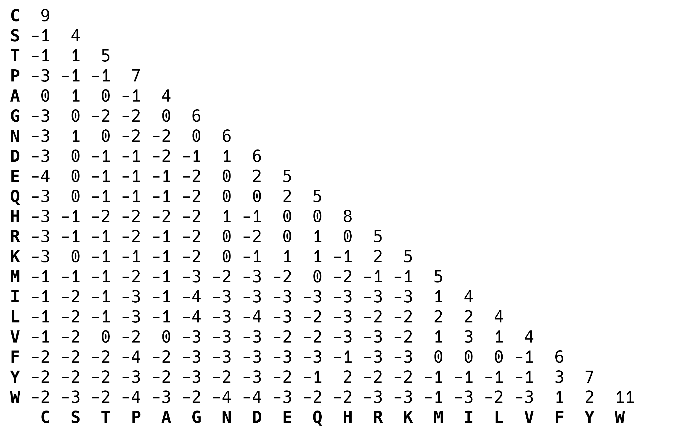
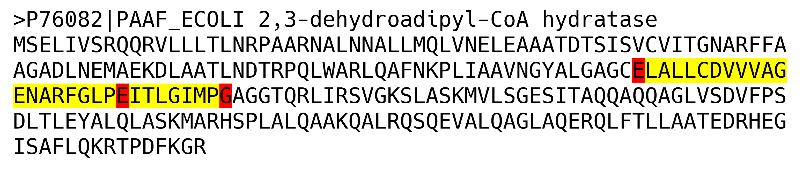

# MMB8052 Practical 06 - Case Study I: Sequence Alignment

# Introduction

The alignment of biological sequences is a core technique in bioinformatics. Without effective algorithms for sequence alignment we wouldn't have methods for predicting protein structure, for working with genome-scale sequencing data or for studying evolution at the molecular level. The foundational algorithms for aligning sequences were developed in the 70s and 80s, and are still used today.

This practical will look at some applications of sequence alignment - including the optimal alignment of two sequences, the use of alignment techniques to search large databases and the simultaneous alignment of multiple sequences. We will use command line tools to explore these applications.

# Principles of Sequence Alignment

Biological sequence alignment relies on an understanding of the molecular mechanisms of evolution, and makes the base assumption that the sequences in an alignment share a common ancestor. The alignment process therefore, is seeking to mirror the point mutations, insertions and deletions which over evolutionary time have given rise to the divergence between the sequences. Of course, this ancestral sequence is unobservable and can only be guessed at - a good quality sequence alignment algorithm will seek to provide an _optimal_ alignment given the available knowledge (i.e. the observable sequences, and the likelihood of certain events occurring).

## Global and Local Alignment

A global alignment algorithm attempts to align every position in every sequence in an alignment. This strategy is most useful when the sequences being aligned are similar and of roughly equivalent size. Local alignments are more useful for dissimilar sequences, or sequences which are expected to contain modules of similarity (_domains_ or _motifs_) within their larger sequence context. A local alignment algorithm does not require a match to be found for every position in the sequences, but can be truncated to preserve only the best matching portion.

The best alignment strategy to choose in any given situation depends on the sequences being analysed, and on the end-goals of the analysis being planned.

## Similarity, Identity and Homology

It has generally been found to be true that a preserved relationship at the sequence level implies a similar conservation of function. We describe the conservation of sequence in terms of sequence identity and (in the case of protein sequences) similarity.

Identity is defined as the percentage of shared positions in a sequence alignment. For example, if in a sequence alignment a pair of sequences have 48 out of 147 positions in common the are said to share 32.65% _identity_.

Similarity is used to describe the relationship between protein sequences in an alignment, and relies on the fact that certain amino acids share similar physiochemical properties and that substitutions between them can be said to be _conservative_. Taking these similarities into account when examining the relationship between sequences means we can calculate a score for the _similarity_.

|  |
|:--:|
| <b>Figure 1: Sequence Identity and Similarity</b>|

Homology is a boolean property shared by sequences of sufficient similarity. Sequences of shared ancestry are said to be _homologous_ - and sequences are either homologous or not, there are no degrees of homology. Homology can exist between species (_orthology_), arising due to a speciation event, or within species (_paralogy_), arising due to a duplication event.

# Pairwise Sequence Alignment

Pairwise sequence alignment methods are used to find the best matching global or local alignments of two query sequences. Methods which use a technique called _dynamic programming_ which are able to find the optimal pairwise alignments were devised in the 70s and 80s. In theory, this renders pairwise alignment a "solved" problem, but the relative efficiency of these methods has meant there has been considerable room for innovation with heuristic methods, which do not guarantee the best alignment but are significantly more efficient than dynamic programming methods.

## Needleman-Wunsch Global Alignment

The Needleman-Wunsch algorithm uses dynamic programming, which breaks down a large problem (finding the optimal sequence alignment) into discrete small steps (scoring the different possibilities at each position of the alignment). In this way, the algorithm is able to efficiently score all possible alignment paths, enabling the choice of the optimal alignment.

This algorithmic approach has to be combined with a robust scoring system. In this way, the effect of allowing a substitution or introducing a gap at each mismatching position in the alignment can be assessed in light of the overall alignment score.

Nucleic acid alignments are normally scored by a simple system where a match carries a positive score and a mismatch carries a negative score. Gaps then usually incur a large penalty to open, but then a smaller penalty to extend, so that a small number of larger gaps is favoured.

Amino acid alignment scoring is more complicated, and usually involves a _substitution matrix_, which encodes different mismatch penalties for different substitutions. This recognises the fact that some amino acid mutations are more likely to occur (due to the nature of the genetic code), and some have a more deleterious effect on protein function than others. Common substitution matrices are based on empirical observation of amino acid changes in closely related biological sequences. For example the popular BLOSUM matrices are generated based on ungapped alignments from the [BLOCKS database](https://academic.oup.com/nar/article/24/1/197/2359962).

|  |
|:--:|
| <b>Figure 2: The BLOSUM62 Substitution Matrix</b>|

### Exercise 6.1 {: .exercise}

Estimated time: 10 minutes

- Download the FASTA sequence for the following UniProt entries: P69905, P01942
- Using APT, install the software package `emboss`
- Read the help information for the Emboss tool `needle`
- Use `needle` to globally align the two sequences you've downloaded

```bash
$ needle -asequence P69905.fasta -bsequence P01942.fasta -gapopen 10.0 -gapextend 0.5 -outfile exercise6_1.needle
```

Consider the following:

- Can you find out more about Emboss and the tools it contains?
- What does the default output of `needle` look like? 
- What's the identity and similarity of the two sequences you downloaded?

## Smith-Waterman Local Alignment  

The Smith-Waterman algorithm was published in 1981 and is an adaptation of Needleman-Wunsch which allows for truncation of alignments to produce high quality _local_ alignments. Since there's no requirement to align the full length of protein sequences, highly conserved _regions_ of otherwise divergent proteins can be optimally aligned. This feature is also useful when aligning a fragment against a much larger whole, for example in the case of aligning some sequencing data to a reference genome (more on this in a later practical). 

Local alignments, although not necessarily the Smith-Waterman algorithm are also used in database searching methods, due to the need to identify partial matches of the query sequence, as well as full-length matches. 

### Exercise 6.2 {: .exercise}

Estimated time: 10 minutes

- Read the help information for the Emboss tool `water`
- Use `water` to locally align the two sequences from exercise 6.1
- Download the FASTA sequence for the following UniProt entries: A0A024R379 and A0A087X1Q5
- Align these two sequences with both `needle` and `water`

Consider the following:

- Compare the local alignment of P69905 & P01942 to the global alignment
- How does the `water` output compare to that of `needle`?
- Make the same comparison for the second pair of sequences

This second pair of sequences share a common _protein domain_ (the [SH2 domain](https://www.ebi.ac.uk/interpro/entry/InterPro/IPR000980/)), but otherwise have little in common. In an ideal world, the local alignment would retrieve just this highly similar portion of about 110 amino acids, but in practise, the scoring system means a longer match gives a higher score.

# Searching Databases Using Sequence Alignment

One of the most popular uses for pairwise alignment is the application of this technique to searching large repositories of sequence information.

As genome sequencing has become widespread the size of biological databases like GenBank has grown exponentially. Efficient ways of searching these huge repositories of information are imperative to deriving value from them. The development of algorithms for precisely this use case has almost as long a history as pairwise alignment itself. 

## BLAST

BLAST, or **B**asic **L**ocal **A**lignment **S**earch **T**ool is a local alignment algorithm that uses _heuristics_ to speed up the alignment procedure, meaning it can be used to efficiently search large databases for sequence matches. BLAST was first released in 1990, and the National Center for Biotechnology Information (NCBI) BLAST web server has been in operation since the NCBI launched their web site, in 1994 and the service still handles thousands of requests every day. The [BLAST paper](https://www.sciencedirect.com/science/article/pii/S0022283605803602?via%3Dihub), by Altschul _et al._ was the most cited paper of the 1990s.

Although the NCBI web server is capable of meeting most users requirements for BLAST searches, there are still good reasons why being able to run searches on our own hardware can be useful. The lack of competition with other users from around the world can make things more efficient, we might want to use a bespoke database which would be hard or impossible to use on the web server version and configuring the search and the output to exactly meet our requirements is easier to do "offline". It is also possible to programmatically run huge numbers of BLAST searches locally which would be impossible to submit via a web interface.  

### Exercise 6.3 {: .exercise}

Estimated time: 15 minutes

- Use the commands below to (a) download the human proteome from UniProt (we looked at how to do this using the Search API in practical 01), and (b) build a BLAST database from the resulting file
  - If you didn't do so earlier in the module, you may need to install the `ncbi-blast+` package using APT. 

```bash
$ wget -O human.fa 'https://rest.uniprot.org/uniprotkb/stream?query=reviewed:true+AND+organism_id:9606&format=fasta'
$ makeblastdb -in human.fa -input_type fasta -dbtype prot -title hsapiens -parse_seqids -taxid 9606 -out hsapiens
```

- Look at the help information for the `blastp` executable, and work out how to search the database you've created with the A0A024R379 sequence you downloaded in exercise 6.2 
- Use the table output format to make the results a bit easier to digest (`-outfmt 6`)
- How many hits do you get in the database, using the default thresholds?

### BLAST E-Value

The Expect value, or E-Value, is the primary means for filtering results from BLAST. It attempts to describe how many matches could be expected in a random database the same size as the subject database, that are at least as good as the reported match (based on the Bit Score). 

The E-Value is often treated like a P-Value (i.e. thresholded at 0.05), but it is slightly different, in that it can take values greater than 1, and the cutoff applied to the E-Value should vary depending on the use-case. For example, hits with short query sequences will very often have E-Values >> 1, but can still be informative. 


## HMMER

The approach of BLAST is based on using a single query sequence to find database hits. When searching for more distant matches especially, the information contained in a single sequence can be inadequate. The approach of HMMER therefore is to use a mathematical model (a Hidden Markov Model, or HMM) built from an alignment of multiple sequences, which imparts more information than one sequence can contain. Using an HMM to search a sequence database can give more results than a simple BLAST, and can be better for detecting remote similarity to the input sequence of interest. 

Although the standard approach of HMMER starts with an alignment, from which an HMM is built, it is possible to begin with a single query sequence. A naive model is then built based on a substitution matrix which infers additional information on top of the input sequence. This model is then used to search the sequence database. 

It is also possible to use HMMER iteratively - the first search returns a set of proteins which are used to build an HMM for a second search, the results from which are used to improve the model, and so on. Both of these modes are enabled by the `hmmer` package which can be installed with `apt`:

```bash
$ sudo apt install hmmer
# search a (FASTA) database with a single query:
$ phmmer --tblout hmmer.out A0A024R379.fasta human.fa
# perform an iterative search (max of 5 iterations by default)
$ jackhmmer --tblout jackhmmer.out A0A024R379.fasta human.fa
```

The A0A024R379 protein contains an [SH2 domain](https://www.ebi.ac.uk/interpro/entry/InterPro/IPR000980/) (a protein domain involved in binding to phosphorylated tyrosine residues on other proteins). The literature suggests that there are 111 human proteins which contain an SH2 domain (<https://doi.org/10.1126/scisignal.2002105>). Although none of the search strategies above identify exactly 111 hits, they all identify a reasonable subset - especially considering only about 100 amino acids of the total query sequence length of 535 amino acids is contained in the SH2 domain. 

# Multiple Sequence Alignment

If we want to explore the evolutionary relationships between more than two sequences, we need different methods to those outlined above, which do not naturally extend to align a greater number of inputs. Computational multiple sequence alignment strategies began to be explored in the late 1980s and many methods have been published since then. Multiple sequence alignment is a multi-dimensional problem, which unlike pairwise alignment does not have an optimal solution (or at least not one which is computationally tractable). Most methods therefore use heuristic methods to take shortcuts on the route to an acceptable solution (a heuristic is an approach to problem solving that does not guarantee an optimal result, but is nevertheless sufficient for reaching an adequate approximation).

There are a number of different approaches taken to constructing multiple sequence alignments, though in practice the actual algorithmic approach matters less than the perceived accuracy of the output (and other metrics such as computational efficiency). Below is a brief summary of the major modern methods.

### T-Coffee

[T-Coffee](https://tcoffee.org/Projects/tcoffee/index.html) is a modern *progressive* alignment based method. A progressive alignment strategy builds a sequence alignment by adding sequences to an initial pairwise alignment, which is made with the closest two sequences. A progressive alignment process begins with the construction of a _guide tree_ - which models the relationships between the sequences to be aligned. The alignment is then constructed on the basis of the branching of this tree, with the closest two sequences aligned first, then the next closest aligned to that alignment and so on. 

Progressive alignment methods are efficient, and can produce large alignments quickly, but they are generally not very accurate when all of the sequences to be aligned are distantly related. The principal problem with progressive alignment is that errors made at any stage in growing the MSA are then propagated through to the final result. 

T-Coffee attempts to overcome this limitation by using local alignments (made with LALIGN) to more accurately construct and weight the guide tree.

T-Coffee and the version of Muscle we want to use are not compatible with one another, so we are not going to use T-Coffee in the following exercise. 

### Muscle

[Muscle](https://bmcbioinformatics.biomedcentral.com/articles/10.1186/1471-2105-5-113) (multiple sequence alignment by log-expectation) is an *iterative* alignment method. Iterative multiple sequence alignment is a similar strategy to progressive alignment, with the key difference that initially aligned sequences can be repeatedly realigned (and so refined) as the alignment is built.

As well as refining the alignment at every iteration, muscle also updates the distance scores between sequences using information from the alignment in order to improve accuracy. 

### Clustal Omega

The Clustal family of MSA tools has been around since the 1980s, and they have historically been progressive alignment methods (including the widely used Clustal W and Clustal X packages). However the newest version, [Clustal Omega](https://www.embopress.org/doi/full/10.1038/msb.2011.75) was released in 2011 and instead uses a seeded guide tree and profile HMM for producing potentially very large multiple alignments (10s of 1000s of sequences).

### Exercise 6.4 {: .exercise}

Estimated time: 15 minutes

- Download the following list of protein sequences from UniProt:
  
```
P76082 P94549 Q52995 P9WNN8 P9wNN9 P64017 O07137 P9WNP1 Q50130 P64019 P9WNN4 P9WNN5 P24162 G4V4T7 P53526 P9WNN7 P9WNN6 Q7U004 Q7TXE1 P9WNN3 A1KN36 P9WNN2 A5U753 A0QJH8 Q73VC7
```

- Install `muscle3` and `clustalo` using APT (you can use `apt search` to find the appropriate packages to install)
- Use each of these tools to make a multiple sequence alignment from the sequences you downloaded in the first step

Alignment comparisons are difficult to make at the command line. In order to examine the resulting alignments, we will download them from our cloud servers and look at them locally. Download files from your VM using Powershell:

```
$ sftp -P [port] student@[your.vm.address]
```

(Where `[port]` and `[your.vm.address]` are the same as the arguments you use to connect via SSH)

This command creates an `sftp` connection to your VM - similar to an SSH connection, but allowing two-way communication. Files can be downloaded from your VM to your computer using the `get` command:

```
$ get practical_06/muscle.fa
```

- Download the 2 alignments you made above

# Uses of Multiple Sequence Alignments

Multiple sequence alignments are primarily used for exploring the evolutionary relationships between sequences. A high quality alignment can be used to calculate a robust phylogenetic tree, showing the lineage of the sequences which have been aligned. Multiple alignments of specified, highly conserved targets (usually the nucleotide sequence of specific housekeeping genes) can be used to estimate the relationships between bacterial species, in a process known as [multi-locus sequence typing](https://www.pnas.org/doi/10.1073/pnas.95.6.3140) (MLST).

Alignments of concatenated pairs of proteins which interact can be used to estimate the [co-evolution](https://academic.oup.com/bioinformatics/article/20/10/1565/237258) of these proteins via an approach called *statistical coupling analysis* - the theory being that amino acids involved in a physical interaction are constrained in their evolution, and that a change in one member of an interacting pair requires a compatible change in the other partner. 

Protein multiple sequence alignments using proteins of known structure are an important input to lots of methods for predicting new 3D structures. Such approaches include [AlphaFold](https://www.nature.com/articles/s41586-021-03819-2) - the algorithm which won the recent [CASP14](https://predictioncenter.org/casp14/) protein structure prediction challenge (by quite some distance), and has since been used to predict a [tertiary structure for every protein in UniProt](https://alphafold.ebi.ac.uk/). 

Important functional residues will be preserved across even distantly-related proteins that share the same function. These residues can be found in a high-quality multiple sequence alignment and a program which enables the viewing of MSAs can help with the finding of such amino acids.

## Jalview

One such alignment viewer is Jalview - developed by the [Barton Group](https://www.compbio.dundee.ac.uk/) at Dundee University, Jalview has been around for a number of years and has been steadily developed into a robust and versatile tool for working with multiple sequence alignments. 

### Exercise 6.5 {: .exercise}

Estimated time: 15 minutes

Jalview is not installed on the cluster PCs, but since it doesn't require admin rights, we can install it:

- Download Jalview from <https://jalview.org/download> (click on the green 'Download' button in the middle of the screen)
- Run the installer and follow the instructions
- Once Jalview is installed, load your sequence alignments from exercise 6.4 and explore them, and the features of Jalview

In particular, consider the following:

- All the sequences you have aligned are annotated with the same Enzyme Commission identifier ([4.2.1.17](https://www.brenda-enzymes.org/enzyme.php?ecno=4.2.1.17) - enoyl-CoA hydratase) - this means they _should_ all have the same biochemical function. To exhibit this function, these enzymes require 2 of 3 key residues to be negatively charged - these residues are at position 109, 129 and 137 in P76082 (see figure 3 below). How many of the sequences in your alignment(s) have 2 negatively charged amino acids (D or E) at the appropriate positions? 

|  |
|:--:|
| <b>Figure 3: P76082 sequence, with functional region highlighted in yellow. Key residues highlighted in red - 2 of 3 must be negatively charged (D or E) for protein to be function as a hydratase</b>|

- Does this result vary depending on the software that produced the alignment?


# Summary

This practical has been the first of our more applied examples of the tools you learnt how to use in the early practicals. The uses for sequence alignment are many and varied throughout bioinformatics, and we have just scratched the surface of what is possible here. Despite algorithms dating back to the late 1970s, much about sequence alignment strategies is still very relevant to modern biomedical science and there are many recent applications which absolutely depend on robust sequence alignment techniques.

In the next practical, we will take a look at one of these approaches - the high-throughput sequencing of genomic DNA, particularly from humans. 

