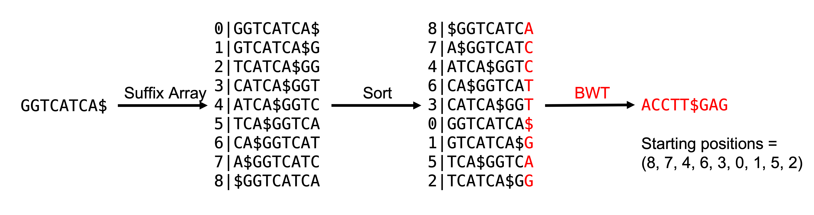

# MMB8052 Practical 07 - Case Study II: High Throughput Alignment and DNA Variants

# Introduction

A large number of high-throughput sequencing applications require a step to align the raw reads to an appropriate reference genome. This step is often also the slowest step of any analysis pipeline. This is because the aligner is attempting to solve a computationally intensive problem - to find the location of each read in an experiment in a (often large) reference genome.  

High-throughput alignment was an area of very active research in bioinformatics for a number of years around the development of so-called "next generation" sequencing, and consequently there are a large number of actively-developed aligners.  There have been two major approaches taken to short read alignment: hash-table based implementations and Burrows-Wheeler Transform (BWT) based methods.

## Hash Table

The earliest methods developed specifically for short read data took this approach.  “Hash table” refers to a common way of representing data in computer programs that is able to index complex data in a way that facilitates rapid searching.  Hash tables are good for sequencing reads because they are very unlikely to contain every possible combination of nucleotides, and very likely to contain duplicates.  The hash table is built either from the short reads or the genome, and then the un-hashed set of sequences is used to scan the hash table.  This rapidly identifies a seed alignment for every read in the dataset, and a specialized alignment algorithm is then used to determine the read’s exact placement on the reference genome (this is often an implementation of the Smith-Waterman local sequence alignment).

## Burrows-Wheeler Transform

The second generation of short read aligners are based on the idea that searching a data structure indexed using the Burrows-Wheeler Transform (BWT), which is often used in data compression, is much more efficient than searching the original data structure itself. BWT reorders the genome data such that sequences that exist multiple times appear together in the data structure, then the final index is created that can be used for rapid read placement on the genome. BWT-based algorithms are routinely at least an order of magnitude faster (and under certain conditions easily 30x faster) than the equivalent hash table algorithms, but (initially at least) gapped alignments were not possible using this method.

Later methods based on the BWT added extra steps after finding seed alignments using the indexed genome to allow full-length, gapped alignment of reads to the reference genome.

|  |
|:--:|
| <b>Figure 1: Burrows-Wheeler Transform</b>|