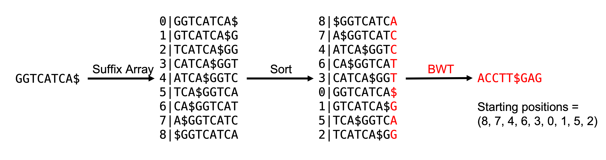
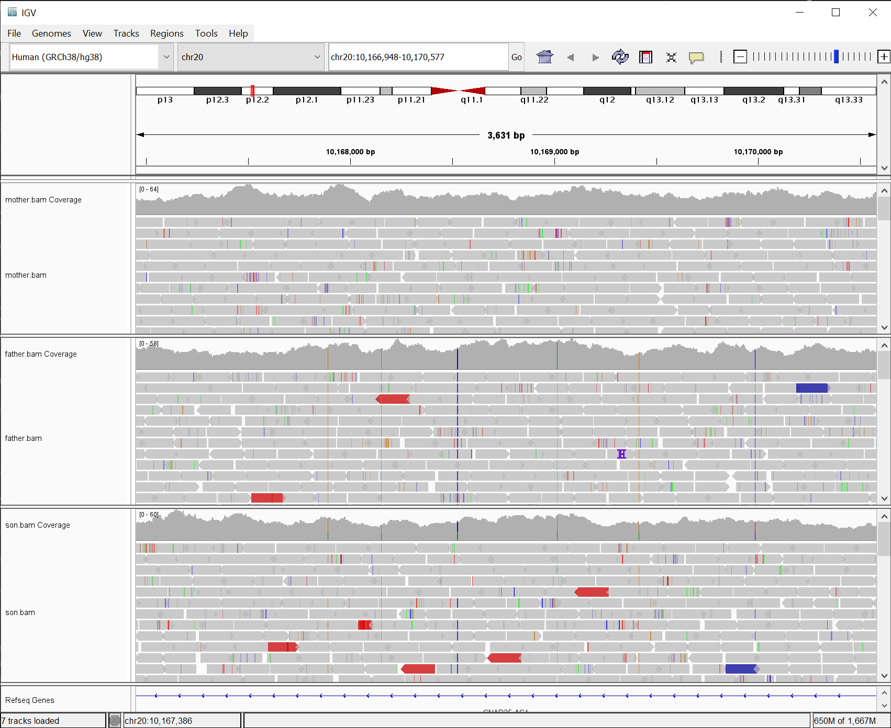
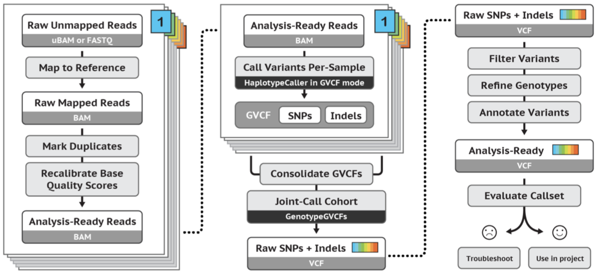
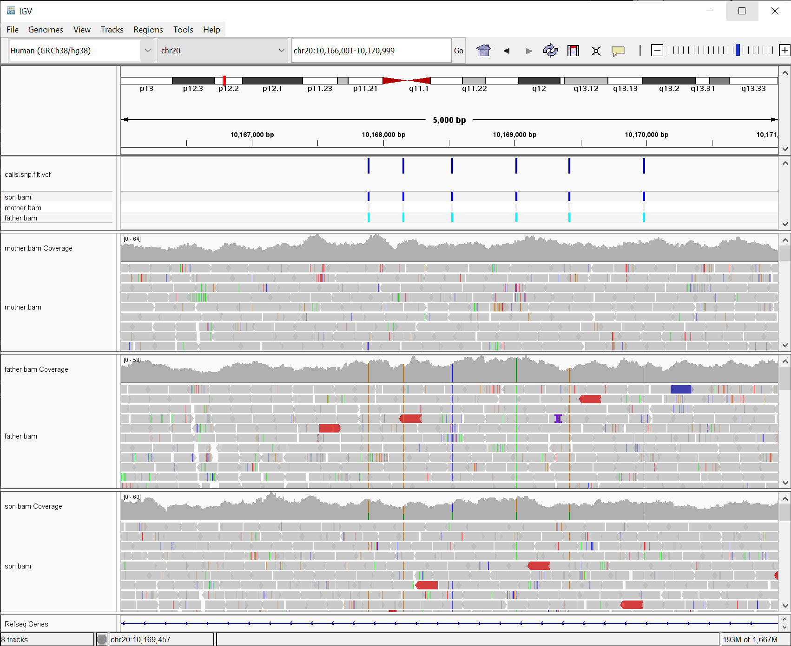

# MMB8052 Practical 07 - Case Study II: High Throughput Alignment and DNA Variants

# Introduction

A large number of high-throughput sequencing applications require a step to align the raw reads to an appropriate reference genome. This step is often also the slowest step of any analysis pipeline. This is because the aligner is attempting to solve a computationally intensive problem - to find the location of each read in an experiment in a (often large) reference genome.  

High-throughput alignment was an area of very active research in bioinformatics for a number of years around the development of so-called "next generation" sequencing, and consequently there are a large number of actively-developed aligners.  There have been two major approaches taken to short read alignment: hash-table based implementations and Burrows-Wheeler Transform (BWT) based methods.

## Hash Table

The earliest methods developed specifically for short read data took this approach.  “Hash table” refers to a common way of representing data in computer programs that is able to index complex data in a way that facilitates rapid searching.  Hash tables are good for sequencing reads because they are very unlikely to contain every possible combination of nucleotides, and very likely to contain duplicates.  The hash table is built either from the short reads or the genome, and then the un-hashed set of sequences is used to scan the hash table.  This rapidly identifies a seed alignment for every read in the dataset, and a specialized alignment algorithm is then used to determine the read’s exact placement on the reference genome (this is often an implementation of the Smith-Waterman local sequence alignment).

## Burrows-Wheeler Transform

The second generation of short read aligners are based on the idea that searching a data structure indexed using the Burrows-Wheeler Transform (BWT), which is often used in data compression, is much more efficient than searching the original data structure itself. BWT reorders the genome data such that sequences that exist multiple times appear together in the data structure, then the final index is created that can be used for rapid read placement on the genome. BWT-based algorithms are routinely at least an order of magnitude faster (and under certain conditions easily 30x faster) than the equivalent hash table algorithms, but (initially at least) gapped alignments were not possible using this method.

Later methods based on the BWT added extra steps after finding seed alignments using the indexed genome to allow full-length, gapped alignment of reads to the reference genome.

|  |
|:--:|
| <b>Figure 1: Burrows-Wheeler Transform</b>|

Using the index shown in figure 1, we can find candidate matches for a "read" sequence by suffix matching and then walking left through the read sequence. 

1. First, look for occurances of the penultimate base in the read sequence. 
2. Find instances of this base which are succeeded by the final base in the sequence. 
     * We can do this by looking at the first character in the rows of the index where the penultimate base is the final character. 
     * Since this column is in strictly alphabetical order, it is a simple matter of counting the numbers of different bases to figure this out.  
3. This will identify a range of starting positions - the next step is to find occurances of the base to the left of the penultimate base with a starting position of n-1 (where n = starting position of penultimate base).
4. Continue to walk left to refine the match.

Alignment strategies will ordinarily define a 'seed length', which is the number of bases from the read to use in this walking left procedure (to use the full length of the read would be inefficient - and would not allow for any gaps or mismatches).

For a read with the sequence ATC we would first look at where the Ts are in our BWT index (positions 4 & 5). Both of these Ts have a C following them (there is 1 $, 2 As and 2 Cs in the sequence, so the 4th and 5th row both start with C). Walking to the left, we are looking for A with a succeeding T - there is only one of these. There are 2 As in the sequence, but the first (position 1), comes at the end of the original sequence - so does not have a T after it. The _starting position_ of this match is 5 - so we have a single match to the sequence ATC, which starts at the 6th base of our "chromosome".

The key to BWT-based alignment strategies is that the _genome_ is transformed (a one-time procedure), but the reads can be used without applying any transformation. This means we can store the transformed genome and use it many times, offsetting the effort required to prepare our data for alignment. 

A Burrows-Wheeler transformed genome also occupies approximately the same amount of disk (and consequently memory) as the genome itself.

### Exercise 7.1  {: .exercise}

Estimated time: 10 minutes

* Install `samtools`, `bcftools` and `bwa` using APT
    * `sudo apt install samtools bcftools bwa`
* Download and extract the data for the practical:
    * <https://hgdownload.soe.ucsc.edu/goldenPath/hg38/chromosomes/chr20.fa.gz>
    * <https://github.com/sjcockell/mmb8052/raw/main/practicals/data/practical_07.zip>
    * Decompress the chromosome 20 sequence with `gunzip`
    * Extract the `practical_07.zip` archive with `unzip`
* Use `bwa` to _index_  the "genome":
    * Get help information for `bwa` by running the command with no arguments
    * You can also view the `man` page online here: <https://bio-bwa.sourceforge.net/bwa.shtml> 

BWA reads a FASTA sequence and transforms it with the BWT to produce a genome index. The indexing process will take a minute or two - once it has finished, have a look at what files have been produced.

* How many new files were produced by `bwa`?
* How big are they, compared to the input FASTA sequence? (HINT: adding the `-l` and `-h` options for `ls` will show you the sizes of your files in KB, MB or GB)

# BWA

BWA, or Burrows-Wheeler Aligner, is software designed by [Heng Li](https://en.wikipedia.org/wiki/Heng_Li) for aligning short high-throughput sequencing reads to a large reference genome, such as the human genome. It is testament to the quality of BWA that it has been around since 2009 (and in it's current form - BWA-MEM - since 2013) and it remains the [recommended algorithm](https://gatk.broadinstitute.org/hc/en-us/articles/360035535912-Data-pre-processing-for-variant-discovery) for DNA alignments when you want to identify polymorphisms in exome or genome sequencing data.

As described above, BWA requires an indexed genome (which we produced in exercise 7.1), it then offers 3 algorithms for actual sequence alignment - backtrack, sw and mem. Backtrack is effectively the "walking left" strategy outlined above, which prohibits the addition of gaps in the resulting alignment and is only recommended for short (< 70bp) reads. The sw algorithm uses a full Smith-Waterman implementation to generate optimal local alignments from seed alignments, which is accurate and flexible but can be slow. Finally, the mem algorithm was designed specifically for aligning longer reads (as Illumina sequencing in particular evolved, reads of 150bp or longer became the norm) and uses a mixture of different approaches to ensure efficiency and accuracy of alignments. 

There are a number of other aligners which are also capable of aligning Illumina-style sequencing reads with varying degrees of success (depending on the metric used to assess them), including (a non-exhastive list): [Bowtie 2](https://bowtie-bio.sourceforge.net/bowtie2/index.shtml), [Isaac](https://academic.oup.com/bioinformatics/article/29/16/2041/199472), [MAQ](https://maq.sourceforge.net/), [Novoalign](http://www.novocraft.com/products/novoalign/) and [HISAT2](http://daehwankimlab.github.io/hisat2/). Some of these tools, particularly Bowtie and HISAT, are still actively developed.


### Exercise 7.2  {: .exercise}

Estimated time: 15 minutes

In exercise 7.1 we made the reference index, now we are going to use it to generate the actual alignments of reads to genome using `bwa mem`. 

The general format of the alignment command is:

```bash
$ bwa mem ref_prefix read1.fastq.gz read2.fastq.gz > aln.sam
```

Where `ref_prefix` is the name you gave to your index in exercise 7.1 (by default this is the name of the reference FASTA file), `read{n}.fastq.gz` are the names of the sequence file or files to align to this reference (the example given is a paired-end experiment with two files) and `aln.sam` is the output alignment, in the Sequence Align/Map format (which was described in practical 02).

The data you downloaded in exercise 7.1 consists of three paired-end samples which consitute a family _trio_. Trios are often used in genetic research when looking for the determinants of disease. By comparing the genomic sequence of an affected individual (the _proband_) to their unaffected parents. This analysis can be used to identify _accumulative_ variants in the proband which contribute to disease - these could be recessive variants which both parents carry, or more complicated compound hetrozygous mutations. It is also possible to use this analysis to look for new, or _de novo_ mutations which have arisen in the proband and are carried by neither parent. 

* Use `bwa mem` to align the reads from the 3 samples to the reference index you built in exercise 7.1

Consider the following:

* Look at the information printed to STDERR as `bwa` runs - what does this tell you about each of the three samples, in terms of read numbers, insert size and mapping rate?
* Have a look at the resulting SAM files - where in the "genome" are the reads aligning?
* Can you find any unaligned reads in the output?

# SAMtools

SAMtools is the Swiss Army knife of alignment manipulation. It provides a huge toolkit of functionality to do almost anything useful with a SAM/BAM file. Like a number of previous tools we've used (including `bwa`), `samtools` uses a system of _verbs_ for determining which tool to use.

```bash
$ samtools --help
```

This command lists all of the available samtools verbs. To get help on any particular function, run that function with no options:

```bash
$ samtools sort
Usage: samtools sort [options...] [in.bam]
Options:
  -l INT     Set compression level, from 0 (uncompressed) to 9 (best)
  -u         Output uncompressed data (equivalent to -l 0)
  -m INT     Set maximum memory per thread; suffix K/M/G recognized [768M]
  -M         Use minimiser for clustering unaligned/unplaced reads
  -K INT     Kmer size to use for minimiser [20]
  -n         Sort by read name (not compatible with samtools index command)
  -t TAG     Sort by value of TAG. Uses position as secondary index (or read name if -n is set)
  -o FILE    Write final output to FILE rather than standard output
  -T PREFIX  Write temporary files to PREFIX.nnnn.bam
      --no-PG
               Do not add a PG line
      --template-coordinate
               Sort by template-coordinate
      --input-fmt-option OPT[=VAL]
               Specify a single input file format option in the form
               of OPTION or OPTION=VALUE
  -O, --output-fmt FORMAT[,OPT[=VAL]]...
               Specify output format (SAM, BAM, CRAM)
      --output-fmt-option OPT[=VAL]
               Specify a single output file format option in the form
               of OPTION or OPTION=VALUE
      --reference FILE
               Reference sequence FASTA FILE [null]
  -@, --threads INT
               Number of additional threads to use [0]
      --write-index
               Automatically index the output files [off]
      --verbosity INT
               Set level of verbosity
```

SAMtools is also designed to make use of output streams and redirection, meaning successive commands can be chained together using pipes (`|`). We will be using SAMtools here to convert our SAM files to the compressed, binary BAM format, and to sort the reads in genomic coordinate order - the two tools for achieving this are `samtools view` and `samtools sort`.

```bash
$ samtools view -b son.sam | samtools sort - > son.bam
```

The first command reads the SAM file produced by `bwa`, and sends it to STDOUT in compressed BAM format. The second command reads this BAM file and sorts the reads in coordinate order - `samtools sort` itself produces a BAM file to STDOUT, so we redirect this output to a file. The `-` in the `samtools sort` command is a placeholder which tells the command _where_ to use the STDOUT that's been redirected (i.e. it is explicitly telling `bash` that the positional input file should be replaced with STDIN).

Since `bwa` itself produces its SAM alignment as STDOUT, we could add this to our pipeline if we wanted:

```bash
$ bwa mem chr20.fa son_R1.fastq.gz son_R2.fastq.gz | samtools view -b - | samtools sort - > son.bam
```

This produces a sorted, compressed alignment in a single command - very useful if you have large numbers of reads and writing intermediate data to disk would be wasteful.

### Exercise 7.3  {: .exercise}

Estimated time: 15 minutes

* Produce sorted, compressed `bam` files for each of the alignments you produced in exercise 7.2, according to the procedure detailed above
* Index these alignments with `samtools index`
* Using `sftp`, transfer your alignments and the `.bai` indexes to your local computer (see practical 6 for `sftp` instructions)

What does the `-b` option in the `samtools view` call do?

Have a look at the size of the BAM file, compared with the SAM file. Also note that you can still print the alignment to STDOUT using `samtools view file.bam` (which behaves like `cat` for BAM files).

# Integrative Genomics Viewer

There are a number of tools which we can use to visualise genomic alignments, but the [Integrated Genomics Viewer](https://software.broadinstitute.org/software/igv/) (IGV) has a number of features which makes it a powerful tool for this purpose. 

IGV is relatively easy-to-use, and has display features which means we can visualise the genetic variants in our alignment files. We can also load our three samples alongside each other, which enables the easy comparison between samples. 

IGV falls into a class of visualisation software called _Genome Browsers_. These tools allow the visualisation of any data which can be assigned genomic coordinates. Generally they sit on top of large repositories of genomic infomation which can be viewed alongside the user's own data. Many genome browsers are available on the web - these tools, such as the [UCSC Genome Browser](https://genome.ucsc.edu/) and the [Ensembl Genome Browser](https://www.ensembl.org/index.html) are great for exploring these big genomic datasets, but are not so good for loading your own data. IGV is distinctive in this space because it is a stand-alone tool - this means it is much better at dealing with local data sets, even very large ones, and so it is often favoured when visualising experimental data. 

### Exercise 7.4 {: .exercise}

Estimated time: 15 minutes

* IGV is installed on the cluster PCs, find it in the Start menu and get it running - make sure the reference genome (top left drop-down menu) is set to "Human (GRCh38/hg38)"
* Load the three BAM files you created in earlier exercises (and transferred to your local machine at the end of exercise 7.3)
* In the location box (middle of the top toolbar), paste in the following location: chr20:10,166,001-10,170,999

|  |
|:--:|
| <b>Figure 2: Integrative Genomics Viewer used to visualise BAM files.</b>|

Individual mismatched bases (compared to the reference genome) are highlighted in the indiviudally aligned reads. Positions at which a large proportion of reads indicate a variable base at the same location are indicated in the 'Coverage' track. 

* Take a look at this region - are there many positions where the variation is consistent among lots of reads?
* Do the sequences of the parents and proband behave as you'd expect at these positions?

# Variant Calling

IGV helps us to visually identify regions of interest in our samples, but in a whole exome or whole genome experiment, this sort of visual inspection does not scale. Instead we need a statistical approach to robustly identify sites of interesting variation in sets of samples. 

Since we are working here with a very small dataset, the most robust methods for variant calling will not work, as they rely on having at least exome-scale data to train their sophisticated models. For an idea of the computational procedures required for this kind of robust variant calling, take a look at the "Best Practise" guidelines produced by the development team behind the [Genome Analysis Toolkit](https://gatk.broadinstitute.org/hc/en-us) (GATK), here: <https://gatk.broadinstitute.org/hc/en-us/articles/360035535932-Germline-short-variant-discovery-SNPs-Indels->.

The Genome Analysis Toolkit is the "industry standard" variant caller. It was originally developed for the [1,000 Genomes Project](https://www.internationalgenome.org/) and has continued to be developed since by a large software engineering team. GATK provides tools for every step of the variant calling process, and the variant callers themselves use complicated machine- and deep-learning models to derive variant calls.

|  |
|:--:|
| <b>Figure 3: GATK Best Practise Guidelines.</b>|

In particular, we are going to skip a number of pre-processing steps designed to reduce noise in the resulting call-set. In a real experiment, with a more realistic volume of data, we would absolutely follow the recommendations described above. 

To allow us to produce some sort of callset from our minimal example, we are going to use the simpler models provided by BCFtools - a toolkit produced by the same group as SAMtools. 

BCFtools calls variants in a two-step process. Firstly `bcftools mpileup` constructs a vertical slice across all reads covering each position of the genome (_pileup_). Genotype likelihoods, which represent how consistent the observed data are with the possible diploid genotypes, are constructed for each site. This calculation takes many different factors into account, including mapping qualities of the reads, and the probability of local misalignment.

The second step, `bcftools call`, evaluates the most likely genotype under the assumption of [Hardy-Weinberg equilibrium](https://www.frontiersin.org/articles/10.3389/fgene.2020.00210/full) using allele frequencies estimated from the data or provided explicitly by the user.

### Exercise 7.5 {: .exercise}

Estimated time: rest of the session

* Use `bcftools` to call variants in the samples aligned earlier. This can be done with a single piped command:

```bash
$ bcftools mpileup -f chr20.fa son.s.bam mother.s.bam father.s.bam | bcftools call -mv -Ob -o calls.bcf
```

You could split this into two commands if you wanted to take a look at the `mpileup` output.

* Use `bcftools view` to explore the VCF file that the above command produced. The header of the file describes the format.
* Filter the callset via the following procedures. Read the documentation to figure out what these filters do:

```bash
$ bcftools view -Ob -g ^miss -v snps calls.bcf > calls.snp.bcf
$ bcftools view -Ob -i 'QUAL>=20' calls.snp.bcf > calls.snp.filt.bcf
```

* Use `bcftools view` to convert the binary BCF file to a plain text VCF:

```bash
$ bcftools view -Ov calls.snp.filt.bcf > calls.snp.filt.vcf
```

* Use `sftp` to transfer the VCF file to your local machine, and load it in IGV. 

|  |
|:--:|
| <b>Figure 4: IGV with VCF loaded alongside BAM files.</b>|

* Finally, `bcftools` has a plugin which lets us check the called variants against Mendelian assumptions (i.e. that the offspring should be a consistent mix of the parents genotype). For this, you need a file which describes the genetic pedigree of the samples - known as as `.ped` file. A `.ped` file to describe our samples was included in the `practical_07.zip` file which you downloaded at the beginning of the practical
* Use the `mendelian` plugin to check the consistency of the variants:

```bash
$ bcftools +mendelian -m c -p samples.ped calls.snp.filt.bcf
```

* You can list any inconsistent sites by changing the "mode" (`-m`) to `x`. Do this and have a look at any inconsistent sites in IGV - can you explain the inconsistency?

# Summary

This practical is a demonstration of the enduring ability of sequence alignment to power bioinformatics analysis. As our capacity for sequencing data generation has evolved, so too have the techniques for processing this data. This is typified by the development of advanced algorithms for aligning millions or even billions of high-throughput sequencing reads to a reference genome in an acceptable amount of "wall-clock" time. 

The accurate calling of genomic variation is an ongoing challenge in bioinformatics, particularly in human genomes. We have scratched the surface of this topic here, but we can see that even a relatively simple model can be helpful to summarise the complicated variability that we observe in real samples. 

The Linux command line is of vital importance to the way that these kinds of analyses work, as the cohorts used in genetic studies tend to be large, which means a lot of data needs to be processed in as "hands-off" a way as possible. Non-interactive command line workflows, often deployed on high-performance computing resources (which exclusively run on Linux) are absolutely key in the delivery of this type of analysis. 

# Quick Quiz

<iframe src="https://newcastle.h5p.com/content/1292126295878616437/embed" aria-label="Practical 7" width="1088" height="637" frameborder="0" allowfullscreen="allowfullscreen" allow="autoplay *; geolocation *; microphone *; camera *; midi *; encrypted-media *"></iframe><script src="https://newcastle.h5p.com/js/h5p-resizer.js" charset="UTF-8"></script>