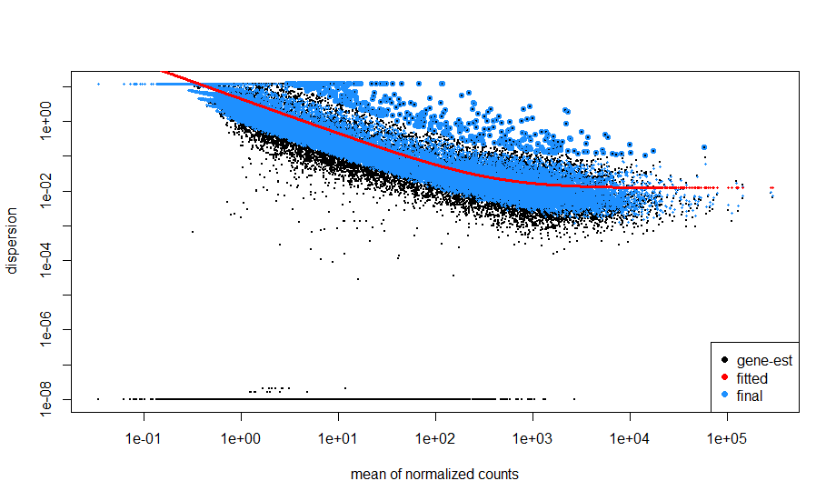

# MMB8052 Practical 08 - Case Study III: RNA Sequencing Analysis

# Introduction

The analysis of gene expression data, generated by an RNA Sequencing (RNA-Seq) experiment, is one of the most common bioinformatics applications. Transcriptomics technologies have seen a lot of development over the last 25 years, and RNA-Seq is just the latest in a long line of techniques for assaying gene expression on a whole genome scale. The techniques for robust data analysis have developed alongside the experimental technologies. 

# A note on this practical, and the assessment

For this practical, I have provided all of the code required to complete the exercises. This is the practical that forms the basis of the second assessment, and so it is important that you can complete the exercises as they are documented here. It is also possible to download the code for completing these exercises from the module Github repository. 

## RNA Sequencing

RNA Sequencing experiments take advantage of a simple assumption – that the number of reads that map to a particular molecule in a next generation experiment is in direct proportion to both its length, and the amount of that molecule that is present in the sample. So if two RNAs of equal length are present at a ratio of 2:1 in two samples, then we will retrieve twice as many reads for one as we will for the other when we sequence the samples. So, given two samples we can normalise for transcript lengths and total number of reads, and work out which species are differentially expressed between the two samples.

RNA-Seq is often seen as a replacement for the very popular microarray approach to studying gene expression, and while the two approaches have different strengths and weaknesses, it is generally true that the data from RNA-Seq correlates better with qPCR data (the “gold standard” for measuring gene expression data) and the sheer depth of the data generated makes RNA-Seq the better choice in many circumstances (assuming the budget allows).

This also means that many of the mistakes, with regards to experimental design, that were made in the early days of microarrays have been repeated in earnest with RNA-Seq experiments. One of the most common false assumptions is that with RNA-Seq you don’t need replicates. This is simply untrue, we still need to model the variance of the population in order to return meaningful statistics and consequently it’s advisable to do at least 4 biological replicates per condition minimum for cell lines, more for mice/rats and many more for humans. Unlike with microarray analysis however technical replicates are seldom required, as despite the stochastic nature of sequencing runs they tend to be highly reproducible.

## RNA-Seq Analysis

After quality assessment (not covered here, but important), RNA-Seq analysis usually comprises 3 (or 4) steps:

1. Align sequencing reads to a reference genome (this step is increasingly optional)
2. Quantify RNA expression against reference gene annotation
3. Analyse RNA counts to define differential expression
4. Functional analysis of differentially expressed genes

Here, we will be focussing on step 3, which is the bulk of the analysis. The final case study in the module will cover functional analysis – which can be applied downstream of many analysis tasks (not just RNA-Seq).

The data we will be working with, and the process for downloading and processing the data to make it ready for step 3 are available from the module's Github page: <https://github.com/sjcockell/mmb8052/tree/main/practicals/practical_08>

## RNA-Seq Read Alignment

We covered alignment of high-throughput sequencing reads to a reference genome in practical 7, and much of what we discussed there holds true for RNA-Seq alignment (the need for efficiency as experiments contain millions of reads, the nature of the alignment problem etc) with one key difference. The constructs in the sequencing library are derived from RNA, and in the case of eukaryotic mRNA that RNA is spliced post-transcription. Splicing means that a single read sequence may be derived from more than one genomic location, often separated by thousands of bases because of an intervening intron which has been spliced out. A read aligner designed for RNA-Seq data therefore has to be able to cope with split reads which arise because of splicing. 

Examples of splice-aware read aligners include:

* STAR - <https://doi.org/10.1093/bioinformatics/bts635>
* HISAT2 - <https://doi.org/10.1038/s41587-019-0201-4>
* Tophat2 - <https://doi.org/10.1186/gb-2013-14-4-r36>

## Quantification of RNA-Seq Data

Modern RNA-Seq analysis procedures tend to avoid the alignment step, which is computationally costly, slow, and results in very large output files. These output files are largely redundant, given that they replicate the contents of the raw FASTQ files.

Rather than alignment, tools which quantify transcript expression via read abundances tend to be favoured in modern analysis. We will be working with data produced by [Salmon](https://combine-lab.github.io/salmon/), a tool which performs _quasi-alignment_ to assign sequencing reads to their transcript of origin. The process by which the quantification estimates we will be working with have been produced will be described below. 

### Quasi-alignment

Instead of the more ‘traditional’ approach of a full read alignment to the reference genome, Salmon uses an efficient, lightweight alignment methodology to assign the reads in an RNA-Seq experiment to their parent transcripts. It then uses these assignments directly to estimate the abundance of each transcript from the reference annotation in the sample.

It is possible for reads to be assigned to more than one transcript – since many transcripts from one gene can share exons. These ambiguous reads are assigned fractionally based on abundance estimates for the possible transcripts made using uniquely assigned reads. For this reason, despite read assignment looking like a discrete, counting problem, we end up with fractional transcript abundances.

### Annotation

There are many sources of gene annotation available. Even for well-annotated organisms, these resources vary in the approaches they take to annotation, and therefore how complete (or otherwise) they appear.

The annotation used in an RNA-Seq experiment is one of the [biggest factors](https://bmcbioinformatics.biomedcentral.com/articles/10.1186/1471-2105-14-S11-S8) effecting the outcome of the data analysis. The choices available largely depend on the organism that you're working with. For human and mouse experiments, [GENCODE](https://www.gencodegenes.org/) is recommended. The GENCODE gene sets are a combination of the HAVANA manual annotation, and the Ensembl automatic annotation pipeline. The goal is to achieve an accurate and complete annotation of the human (and mouse) genome.

For other organisms, I would recommend working with the Ensembl annotation, where possible. The quality of Ensembl gene sets is consistent, and the data is easily available. The Ensembl FTP server is a convenient resource for this data for many organisms: <http://www.ensembl.org/info/data/ftp/index.html>

For this example experiment, the data was derived from mouse cells, so we can download the latest GENCODE mouse gene set, using wget:

```bash 
$ wget -O extdata/gencode.vM31.transcripts.fa.gz https://ftp.ebi.ac.uk/pub/databases/gencode/Gencode_mouse/release_M31/gencode.vM31.transcripts.fa.gz
```

This FASTA sequence file is then indexed for use with Salmon. This is similar to the genome indexing carried out for alignment - a one-time, reasonably intensive procedure which can be stored and used multiple times. 

```bash
$ salmon index -t extdata/gencode.vM31.transcripts.fa.gz -i extdata/gencode.vM31.transcripts.idx
```

### Quantification

Since the raw RNA-Seq data we are working with is large (12GB), and the process of quantification still relatively time-consuming (in the context of a 3-hour practical), the quantification has already been completed. The general process for this is to use `salmon quant` for each sample:

```bash
for sample in sample_list
do
    salmon quant -l A -r data/${sample}.fastq.gz -i extdata/gencode.vM31.transcripts.idx -p 20 -o results/counts/${sample}
done
```

This produces a file (`quant.sf`) for each sample, which contains the transcript-level quantification data for that sample. Below is an abbreviated version of this data for five transcripts:

```
Name                    Length  EffectiveLength TPM         NumReads
ENSMUST00000162795.8    2712    2462.000        1.616710    86.647
ENSMUST00000161327.8    5707    5457.000        4.565086    542.297
ENSMUST00000159802.2    4136    3886.000        0.203616    17.225
ENSMUST00000162257.8    2204    1954.000        4.089634    173.958
ENSMUST00000159206.2    519     269.000         2.585507    15.140
```

# The Dataset - GSE116583

For the exercises in this practical, we will be using a publicly available RNA-Seq dataset from the Gene Expression Omnibus (GEO). This dataset is from murine alveolar macrophages early after reperfusion (restoration of blood flow once the organ is in place in the receipient) in a model of lung transplantation. The data is described in the GEO entry: [GSE116583](https://www.ncbi.nlm.nih.gov/geo/query/acc.cgi?acc=GSE116583). There's lots of information about the experiment which generated the data in the so-called SOFT format file which you can download from the entry: <https://ftp.ncbi.nlm.nih.gov/geo/series/GSE116nnn/GSE116583/soft/GSE116583_family.soft.gz>. This can be quite hard to understand, so I've extracted some key information in the table below.

| Metadata Header | Experiment Information |
|-----------------|------------------------|
| Timepoints | Naive (control), 2 hours post-reperfusion, 24 hours post-reperfusion (n = 4) |
| Sample Extract Protocol | PicoPure (Thermofisher) RNA isolation kit. RNA libraries were prepared for sequencing using standard Illumina protocols. |
| Mouse Genotype | Cx3cr1<sup>gfp/+</sup>B6 |
| Mouse Sex | Male |
| Mouse Age | 14 weeks |
| Tissue | Lung |
| Cell Type | alveolar macrophage |
| RNA-Seq type | polyA RNA |
| Sequencer | NextSeq 500 |
| Library layout | Single-end |
| Read Length | 75 bp | 

As is often the case with publicly available data, the amount of information on how the experiment was carried out is quite sparse. We can learn more about the role of alveolar macrophages (and macrophages more widely) in organ transplantation here: <https://doi.org/10.1111/ajt.15751>. The lab which produced the data in GSE116583 has documented their mouse lung transplant protocol in this work: <https://doi.org/10.1126/scitranslmed.aal4508> (protocol information is in the [Supplementary Materials](https://www.science.org/doi/suppl/10.1126/scitranslmed.aal4508/suppl_file/aal4508_sm.pdf)).

I have downloaded the FASTQ data for the 12 samples in this experiment, and used Salmon as documented above to quantify the transcript-level expression in each sample. 

The `quant.sf` files which result from this process can be downloaded here: <https://github.com/sjcockell/mmb8052/raw/main/practicals/practical_08/results/counts.zip>. The full process and documentation, and a sample table can be viewed in the module's Github page, see here: <https://github.com/sjcockell/mmb8052/tree/main/practicals/practical_08>. Finally, a sample table (which we will use in the exercises below) can be downloaded from here: <https://raw.githubusercontent.com/sjcockell/mmb8052/main/practicals/practical_08/data/sample_table.csv>.

### Exercise 8.1 {: .exercise}

Estimated time: 10 minutes

* Install and load all the packages we will need for this practical:

```r
> install.packages('BiocManager')
> library(BiocManager)
> install(c('tximport', 'DESeq2', 'biomaRt', 'pheatmap'))
> library(tximport)
> library(DESeq2)
> library(biomaRt)
> library(pheatmap)
> library(tidyverse)
```

* The first line of the above code install Bioconductor (an R package manager for bioinformatics). The subsequent `install()` command uses the Bioconductor installer to locate the rest of the required packages. 
* Bioconductor packages are not available in CRAN, so cannot be installed with `install.packages()`. The Bioconductor installer, on the other hand, is capable of installing CRAN packages (such as `pheatmap`, here).
* Some of these packages may take some time to install (particularly `DESeq2` which has a lot of dependencies). If you find yourself waiting, read the next section and come back in a few minutes to check if the installation has worked.

# tximport

Reading data from a large number of files into a single data frame is not very convenient - fortunately, `tximport` is a Bioconductor package that makes this simple for the data produced by Salmon. It also summarises Salmon’s transcript-level counts to a gene-level abundance estimate. This gene-level estimate is much more suitable for conventional RNA-Seq analysis.

For `tximport`, we need three pieces of information:

1. a vector of the names of the count files on our file system
2. that vector needs `names()` which match the sample names
3. a `data.frame` (or `tibble`) that maps the transcript IDs in the count file to their parent gene IDs

We can generate the first two using the sample table mentioned above, along with some of the helpful Tidyverse packages that were introduced during practical 5. The third piece of information is provided in an addtional file.

### Exercise 8.2 {: .exercise}

Estimated time: 5 minutes

* Download the count data <https://github.com/sjcockell/mmb8052/raw/main/practicals/practical_08/results/counts.zip>
* Put this .zip in your R working directory and unzip it
* Run the following R code to read the count data:

```r
> sample_table = read_csv('https://raw.githubusercontent.com/sjcockell/mmb8052/main/practicals/practical_08/data/sample_table.csv')
> files = pull(sample_table, Run)
> files = paste0('counts/', files, '/quant.sf')
> names(files) = pull(sample_table, Run)
> gene_map = read_csv('https://github.com/sjcockell/mmb8052/raw/main/practicals/practical_08/extdata/gene_map.csv')
> txi = tximport(files, 
                type='salmon',
                tx2gene=gene_map,
                ignoreTxVersion=TRUE)
```

Consider the following:

* What does the `files` vector contain at the end of this process? What if your count files where elsewhere on the file system?
* What type of variable is `gene_map` and what data is contained within it?
* What does the `ignoreTxVersion` argument for `tximport` do? Can you figure out why this is required?

# DESeq2

`DESeq2` is a specialised package for the analysis of RNA-Seq data - it uses a model based on the negative binomial distribution for testing differential expression.

`DESeq2` provides normalisation and stabilisation procedures for processing the count output from Salmon. The simplest implementation of `DESeq2` is to simply create a dataset and then run the `DESeq()` method over it, but we are going to break this down into the separate steps for greater clarity of what’s actually happening.

## Normalisation

`DESeq2` normalises experiments imported from Salmon by a combination of _size factors_ (which correct read counts based on the size of the sequencing library) and _gene length_. Size factors are calculated using the median-of-ratios method. Briefly, for each row in the counts matrix, `DESeq2` calculates the geometric mean of the row, and then divides
the observed counts by that geometric mean. The size factor for a column (i.e. sample) is the median of these $(observed counts/geometric means)$ across the whole sample. For data imported via `tximport`, DESeq2 also uses the per-gene average transcript length to calculate a normalisation factor for every observation in the experiment, which combines size factor normalisation with average transcript length normalisation. These normalisation factors can be retrieved using the
`normalizationFactors()` method.

## Dispersion Estimates

The _dispersion_ is a genewise measure of the variance of the count data. It is used in `DESeq2` to model the _biological noise_ in the system. The variance (which is used by the statistical test performed in the next step) is the sum of this measure of biological variance and the shot noise, which is a measure of the uncertainty of read counting as a quantitative metric. For highly expressed genes, the biological noise dominates, for lowly expressed genes it's the shot noise that
dominates.

In `DESeq2` (in contrast to the older `DESeq`), the dispersion estimates are submitted to empirical Bayes shrinkage. The full details of this, in all their impenetrable, statistical glory, are available in the [`DESeq2` paper](https://doi.org/10.1186/s13059-014-0550-8) (as you may notice from the title of that paper, fold change estimates are also shrunk by a related methodology).

Dispersion estimates can also be plotted (see Figure 1). This can be a useful diagnostic plot for an RNA-Seq experiment - the kind of relationship seen in this experiment between mean count and dispersion is typical, where variance decreases with increasing read count. A deviation from this usual relationship could be cause for concern for your analysis.

|  |
|:--:|
| <b>Figure 1: Plot of dispersion estimates for GSE116583.</b>|

## Applying Statistics

`DESeq2` uses Wald’s Negative Binomial test to determine whether genes are differentially expressed. This test is appropriate for the discrete nature of RNA-Seq data, and the distribution it typically fits. At this point, we have got as far as the convenience method `DESeq()` would take us.

Before we begin, we should create a ‘factor’ in our sample table - this is a categorical description
of the groups we want to analyse using DESeq2. We can use dplyr::mutate to combine the
timepoint and condition columns in our sample table to achieve this.